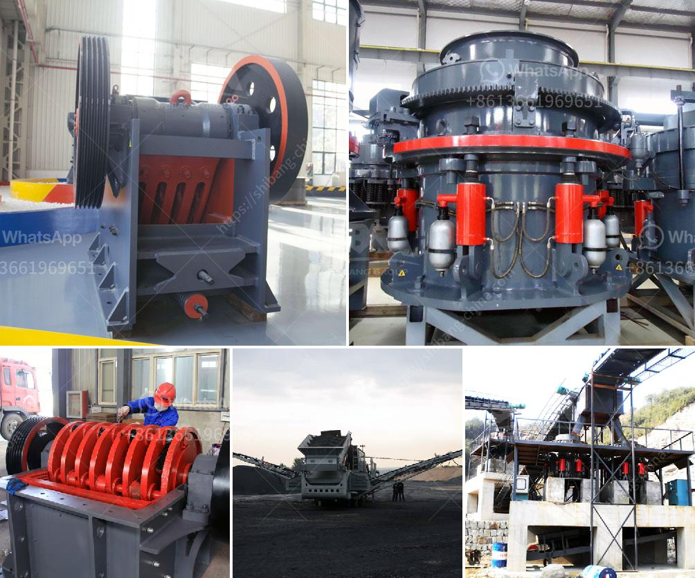

<h3>trommel screen for sale south africa</h3>
If you are in the market for a trommel screen for sale South Africa, then you have come to the right place. These screens are used to separate various materials into different sizes, which is essential for sorting and recycling materials. With the increasing demand for recycling and the growing need for waste management in South Africa, there is a significant need for trommel screens.

A trommel screen is a cylindrical drum-like screen that is usually tilted at an angle. The material is fed into the drum and moves along the length as it is sifted and sorted. The trommel screen consists of rotating cylindrical drums made of perforated plates, bars or wire mesh. This screening process is critical for various industries such as mining, construction, waste management, recycling, and composting.

One of the significant advantages of a trommel screen is its versatility. These screens can handle a wide range of materials such as soil, sand, gravel, wood chips, mulch, and even compost. The size of the holes in the screen can be adjusted to produce different-sized outputs, depending on the specific needs of the application. This flexibility allows businesses and organizations to tailor the trommel screen to their specific requirements.

In South Africa, the demand for trommel screens is growing as more businesses recognize the value of separating waste materials efficiently. Trommel screens offer significant advantages over other screening methods. They are highly efficient and can process large volumes of material quickly. The rotating drum constantly agitates the material, breaking up clumps and ensuring an even distribution for more accurate sorting.

Furthermore, trommel screens are low maintenance and have a long lifespan. They are designed to withstand the harsh conditions typically encountered in waste management and recycling applications. The drums are typically made of high-quality materials and have a robust construction that can withstand the constant movement and abrasion. Additionally, many trommel screens come with features such as self-cleaning screens, eliminating the need for manual cleaning and reducing downtime.

When considering purchasing a trommel screen in South Africa, it is vital to choose a reputable supplier. Look for a company that has a track record of supplying high-quality equipment and providing excellent after-sales service. Consider factors such as warranty, technical support, and spare parts availability. Additionally, it is crucial to assess your specific needs and determine the appropriate size and specifications for your application.

In conclusion, a trommel screen is an essential piece of equipment for businesses and organizations involved in waste management, recycling, and material separation. With the increasing demand for recycling in South Africa, a trommel screen can help businesses sort various materials efficiently. Ensure you choose a reputable supplier to guarantee the quality and longevity of the equipment. With the right trommel screen, businesses can optimize their operations and contribute to a greener and more sustainable future for South Africa.
<h3>Contact us</h3><ul><li><strong>Whatsapp:&nbsp;<a href="https://wa.me/8613661969651">+8613661969651</a></strong></li><li><a href="https://swt.shibang-china.com/?git&amp;zhl&amp;trommel screen for sale south africa"><strong>Online Service(chat now)</strong></a></li></ul><h3>Related</h3><ul><li><a href='ballast crusher machine price.md'>ballast crusher machine price</a></li><li><a href='ton crushers south africa for sale.md'>ton crushers south africa for sale</a></li><li><a href='crusher mobile stone crusher.md'>crusher mobile stone crusher</a></li><li><a href='gold mining equipments manufacturers.md'>gold mining equipments manufacturers</a></li><li><a href='vibrating feeders operating parameters from zenith china.md'>vibrating feeders operating parameters from zenith china</a></li></ul>