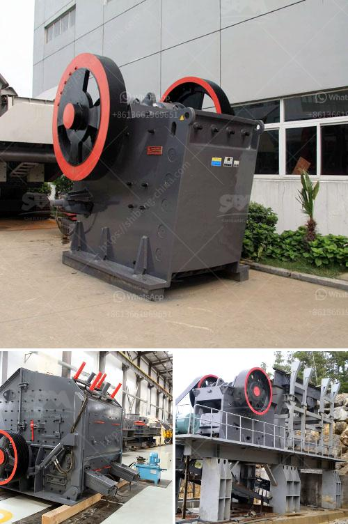

<h3>trommel screen sale australia</h3>
As technology continues to advance, the demand for more efficient and sustainable material recycling processes is growing. One technology that has gained immense popularity in the Australian recycling industry is the trommel screen. The trommel screen is a game-changer in the way materials are sorted and processed, leading to increased efficiency and reduced waste.

The trommel screen is essentially a cylindrical drum that is inclined at an angle. The material feed enters the drum at one end, while the screened material exits at the other end. As the drum rotates, the material is sorted by size, with smaller particles falling through the screen and larger pieces continuing along the length of the drum.

One of the main advantages of the trommel screen is its ability to handle a wide range of materials. From compost and mulch to construction and demolition waste, the trommel screen can efficiently separate different materials based on their size and composition. This versatility makes it an invaluable tool for the Australian material recycling industry, where a vast array of waste needs to be sorted for reuse or proper disposal.

Another significant advantage of the trommel screen is its efficiency in processing large volumes of material. With its high-capacity drum and effective screening mechanisms, the trommel screen can sort through tonnes of material in a short period. This not only increases productivity but also reduces the processing time required for recycling facilities. As a result, businesses can save on labor costs and improve their overall operational efficiency.

Environmental sustainability is at the forefront of the Australian recycling industry. The trommel screen plays a crucial role in achieving this sustainability goal by reducing waste and improving recycling rates. By efficiently sorting materials, the trommel screen eliminates the need for manual sorting and reduces the chances of recyclable items ending up in landfills. This contributes to the circular economy and helps conserve natural resources by promoting the reuse and recycling of materials.

The demand for trommel screen sale in Australia has seen a significant rise in recent years as companies strive to improve their recycling processes and meet sustainability targets. Many manufacturers are now offering an extensive range of trommel screens, tailored to suit different applications and processing requirements. Whether it's a small-scale recycling facility or a large industrial operation, there is a trommel screen suitable for every purpose.

The advantages of the trommel screen, such as its versatility, efficiency, and sustainability, have made it a game-changer in the Australian material recycling industry. It has revolutionized the way waste is handled and has empowered businesses to achieve their recycling goals more effectively. With the continuous advancements and improvements in trommel screen technology, the future of material recycling in Australia looks brighter than ever.

In conclusion, the trommel screen has become a vital component of the Australian material recycling industry. Its ability to efficiently sort, process, and recycle a wide range of materials has made it a game-changer for businesses striving for efficient and sustainable waste management practices. With its numerous advantages, the trommel screen is set to be a driving force in furthering the growth and success of the Australian recycling industry for years to come.
<h3>Contact us</h3><ul><li><strong>Whatsapp:&nbsp;<a href="https://wa.me/8613661969651">+8613661969651</a></strong></li><li><a href="https://swt.shibang-china.com/?git&amp;zhl&amp;trommel screen sale australia"><strong>Online Service(chat now)</strong></a></li></ul><h3>Related</h3><ul><li><a href='basalt crusher price in senegal.md'>basalt crusher price in senegal</a></li><li><a href='vibrating screens manufacturers.md'>vibrating screens manufacturers</a></li><li><a href='difference between vsi and hsi.md'>difference between vsi and hsi</a></li><li><a href='aggregate crushing plant layout.md'>aggregate crushing plant layout</a></li><li><a href='raymond mill manufacturer.md'>raymond mill manufacturer</a></li></ul>