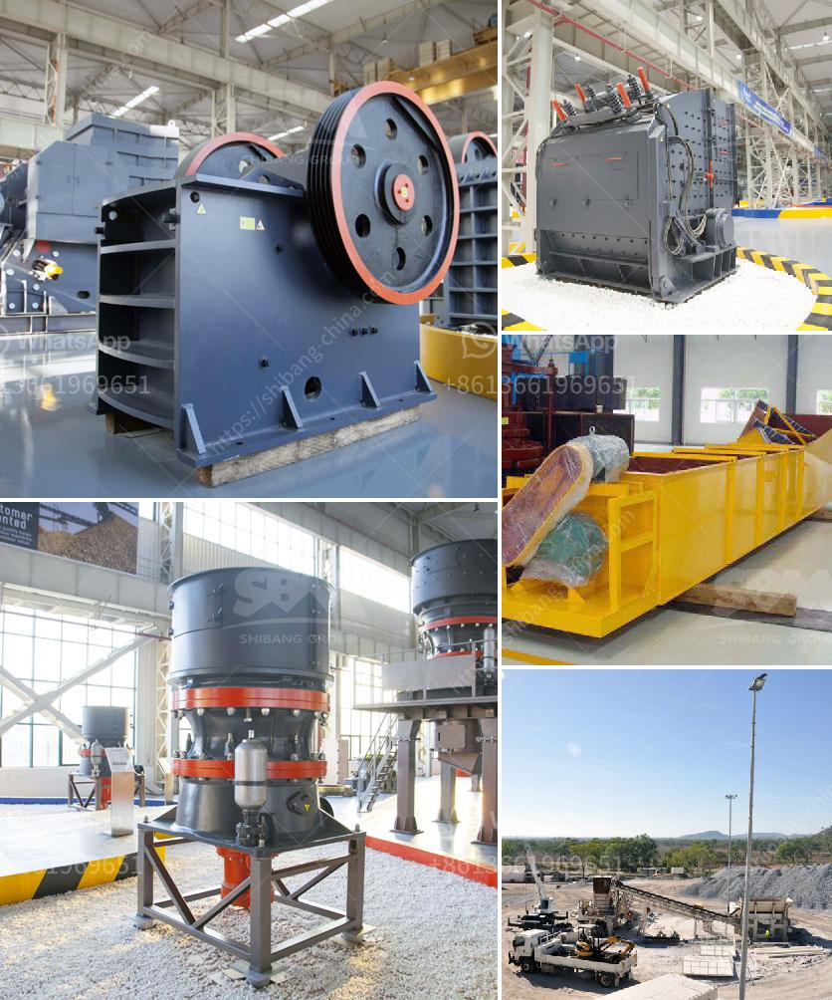

<h3>type of product manufactured vertical mills of india</h3>
India is emerging as a leading player in the manufacturing industry, and one of the prime examples of this is the production of vertical mills. Vertical mills, also known as milling machines, play a crucial role in various industries such as automotive, aerospace, and construction. These machines are used to shape and cut materials with precision, making them an essential tool for any manufacturing process.

Vertical mills manufactured in India are known for their high quality and advanced technology. Companies in India have invested heavily in research and development to produce state-of-the-art milling machines that meet international standards. These mills are equipped with advanced features such as computer numerically controlled (CNC) systems, which allow for precise and automated operation, resulting in faster and more efficient production.

These vertical mills are capable of handling a wide range of materials, including metals, plastics, and composites. They come in various sizes, with different capacities and specifications to cater to different manufacturing needs. From small-scale workshops to large manufacturing plants, vertical mills are used for tasks such as drilling, cutting, contouring, and milling intricate parts.

One of the key advantages of vertical mills manufactured in India is their cost-effectiveness. Indian manufacturers offer competitive pricing without compromising on quality, making their products highly sought after in both domestic and international markets. Additionally, these mills are designed for durability and longevity, ensuring that they can withstand the harsh conditions of a manufacturing environment.

The vertical mills manufactured in India are not only meeting the demand in the domestic market but are also exported to countries around the world. Their reliability, precision, and cost-effectiveness have made them a preferred choice for industries looking to enhance their production processes.

In conclusion, the manufacturing of vertical mills in India is a testament to the country's growing prowess in the manufacturing industry. With advanced technology, competitive pricing, and high-quality standards, Indian vertical mills are playing a crucial role in shaping the global manufacturing landscape.
<h3>Contact us</h3><ul><li><strong>Whatsapp:&nbsp;<a href="https://wa.me/8613661969651">+8613661969651</a></strong></li><li><a href="https://swt.shibang-china.com/?git&amp;zhl&amp;type of product manufactured vertical mills of india"><strong>Online Service(chat now)</strong></a></li></ul><h3>Related</h3><ul><li><a href='wet ball milling.md'>wet ball milling</a></li><li><a href='ball mills for calcium.md'>ball mills for calcium</a></li><li><a href='jaw crusher thailand.md'>jaw crusher thailand</a></li><li><a href='gold mining industry in tanzania.md'>gold mining industry in tanzania</a></li><li><a href='mini mill 12x20 jaw crusher.md'>mini mill 12x20 jaw crusher</a></li></ul>