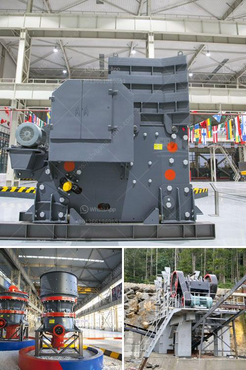

<h3>types of crusher</h3>
Crushing is the first stage of the comminution process that involves reduction in the size of materials. From large chunks of rocks to fine powders, efficient reduction techniques are critical in various industries. Crushers are the primary equipment in this process, and come in different forms, depending on the application.

Here, we will explore the different types of crushers available in the market and their specific uses.

Jaw crushers are versatile machines that are typically used as primary crushers. They are useful for materials that have a high degree of hardness, such as granite, ores, and minerals. Jaw crushers consist of a fixed jaw plate and a movable jaw plate. The rock is trapped and crushed between the jaws, which are further divided into two types: single-toggle and double-toggle jaw crushers.

Gyratory crushers are used for hard and abrasive materials since they can handle large chunks of rock. These crushers have a conical gyratory head that tapers to a narrow gap between the head and the concave. The main advantage of gyratory crushers is their high production capacity.

Cone crushers are commonly used in secondary and tertiary crushing stages in aggregate and mining operations. They are similar in shape to a gyratory crusher, but have a steeper cone angle and a concave bowl surface. Cone crushers provide a smaller particle size than gyratory crushers and can handle materials with a higher moisture content.

Impact crushers utilize impact force to reduce the size of materials by striking them with hammers or blow bars that are fixed onto a rotor. These crushers can be used in a range of applications, from soft to medium-hard rocks. Impact crushers are known for their high production capacity and reduction ratio.

Hammer crushers are used for fine grinding of medium-hard to soft materials. They can process materials with a moisture content of up to 15%. Hammer crushers consist of a rotor with hammers that spin at high speed and impact the material to be crushed. They are commonly used in coal and cement industries.

Roll crushers are used for primary and secondary crushing of materials that have low to medium hardness. In this type of crusher, the material is fed between two rolls, rotating in opposite directions, and is crushed by compression. Roll crushers are often used in mining operations and are capable of producing a more uniform product size compared to jaw or gyratory crushers.

VSI crushers are designed for tertiary and quaternary crushing applications. The rock is fed into a vertical shaft rotor that accelerates the material and throws it against stationary anvils lining the crushing chamber. VSI crushers provide excellent particle shape and are used in the production of high-quality artificial sand.

In conclusion, crushers play a vital role in the mining and construction industries by reducing the size of materials for further processing. Each type of crusher has its unique characteristics and is suitable for specific applications. Therefore, understanding the differences between these crushers can help in selecting the appropriate crushing equipment for a specific operation.
<h3>Contact us</h3><ul><li><strong>Whatsapp:&nbsp;<a href="https://wa.me/8613661969651">+8613661969651</a></strong></li><li><a href="https://swt.shibang-china.com/?git&amp;zhl&amp;types of crusher"><strong>Online Service(chat now)</strong></a></li></ul><h3>Related</h3><ul><li><a href='ball mill 20 ton.md'>ball mill 20 ton</a></li><li><a href='grinding machine made in turkey.md'>grinding machine made in turkey</a></li><li><a href='costruire une machine pour broyer des briques.md'>costruire une machine pour broyer des briques</a></li><li><a href='crushing and screening plant supplier china.md'>crushing and screening plant supplier china</a></li><li><a href='gemstones found in nigeria.md'>gemstones found in nigeria</a></li></ul>