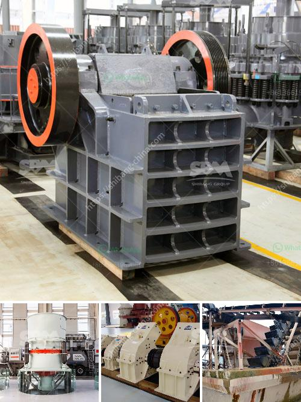

<h3>types of crushers ppt</h3>
A crusher is a machine that crushes large rocks into smaller stones and rocks, gravel, or rock dust. Crushers are commonly used for a variety of different tasks, such as reducing the size of raw materials or processing materials into finer particles. In this article, we will explore the different types of crushers and their applications.

Jaw crushers are designed to handle large pieces of rock and reduce them to smaller sizes. The jaw crusher consists of two plates, one stationary and the other movable, which form a V-shaped chamber. The movable jaw moves back and forth against the stationary jaw as the material is compressed between the two plates. This type of crusher is often used for primary crushing.

Cone crushers are used for secondary and tertiary crushing. They are capable of producing finer particles compared to jaw crushers. Cone crushers work by squeezing the rock between an eccentrically rotating cone and a concave bowl. As the cone moves closer to the bowl, the material is crushed and discharged through the bottom.

Impact crushers utilize the principle of impact to crush materials. They are often used for materials with high compressive strength, such as basalt and granite. Impact crushers can be classified into two main types: horizontal shaft impact (HSI) crushers and vertical shaft impact (VSI) crushers. HSI crushers use a spinning rotor with bars or hammers that repeatedly strike the material until it breaks. VSI crushers use a different approach, involving a high-speed rotor with wear-resistant tips and a crushing chamber designed to 'throw' the rock against hard surfaces for further breaking.

Gyratory crushers are used for primary crushing of various rock types, including hard rocks and ores. They consist of a cone-shaped central mantle, which is driven eccentrically inside a surrounding concave shell. As the mantle gyrates, the material is crushed and discharged through the lower opening.

Roll crushers are mainly used for crushing medium-hard to hard materials, such as coal, limestone, and glass. They consist of two rotating cylinders, with the material being crushed between them. Roll crushers have a relatively simple design and are ideal for producing a narrow range of particle sizes.

Hammer crushers are used for crushing medium-hard and brittle materials, such as limestone, gypsum, and coal. They consist of a series of hammers mounted on a rotating shaft. The material is fed into the crusher and subjected to high-speed impact from the hammers, which crush and disintegrate it.

In conclusion, crushers are essential machines in various industries, including mining, construction, and recycling. Each type of crusher has its own unique characteristics and applications. Jaw crushers are ideal for primary crushing, cone crushers for secondary and tertiary crushing, impact crushers for high-strength materials, gyratory crushers for primary crushing of hard rocks, roll crushers for medium-hard materials, and hammer crushers for brittle materials. By understanding the different types of crushers available, industries can make informed decisions regarding which crusher is best suited for their specific needs and requirements.
<h3>Contact us</h3><ul><li><strong>Whatsapp:&nbsp;<a href="https://wa.me/8613661969651">+8613661969651</a></strong></li><li><a href="https://swt.shibang-china.com/?git&amp;zhl&amp;types of crushers ppt"><strong>Online Service(chat now)</strong></a></li></ul><h3>Related</h3><ul><li><a href='price of grinding powder manufacturing machine.md'>price of grinding powder manufacturing machine</a></li><li><a href='ballast crusher machine price.md'>ballast crusher machine price</a></li><li><a href='aggregate crusher supplier tanzania.md'>aggregate crusher supplier tanzania</a></li><li><a href='philippines crushing machine manufacturer in pakistan.md'>philippines crushing machine manufacturer in pakistan</a></li><li><a href='crushed stone sorting machinery.md'>crushed stone sorting machinery</a></li></ul>