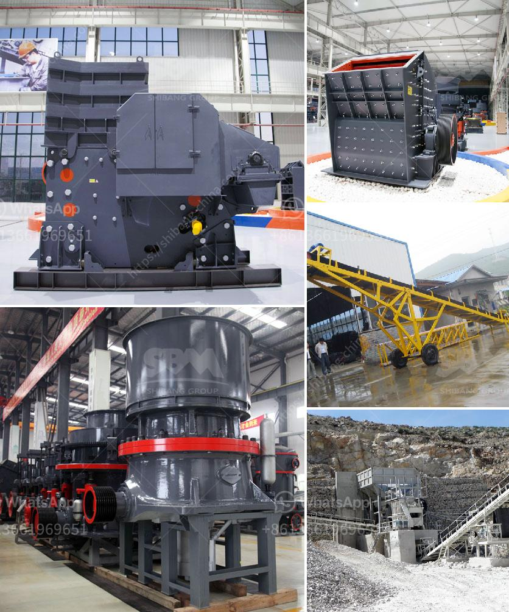

<h3>types of grinding mills</h3>
Grinding mills are a crucial component in the mining, power generation, and ore processing industries. These highly efficient mills utilize coarse and fine grinding to break down and reduce the size of various raw materials. There are different types of grinding mills available, each with its specific benefits and applications. Let's explore a few popular types:
<h3>Contact us</h3><ul><li><strong>Whatsapp:&nbsp;<a href="https://wa.me/8613661969651">+8613661969651</a></strong></li><li><a href="https://swt.shibang-china.com/?git&amp;zhl&amp;types of grinding mills"><strong>Online Service(chat now)</strong></a></li></ul><h3>Related</h3><ul><li><a href='used crushers for sale nigeria.md'>used crushers for sale nigeria</a></li><li><a href='mills road crusher machine.md'>mills road crusher machine</a></li><li><a href='recycled glass price per tonne in durban.md'>recycled glass price per tonne in durban</a></li><li><a href='construction conveyor for sale.md'>construction conveyor for sale</a></li><li><a href='sand powder milling machine.md'>sand powder milling machine</a></li></ul>