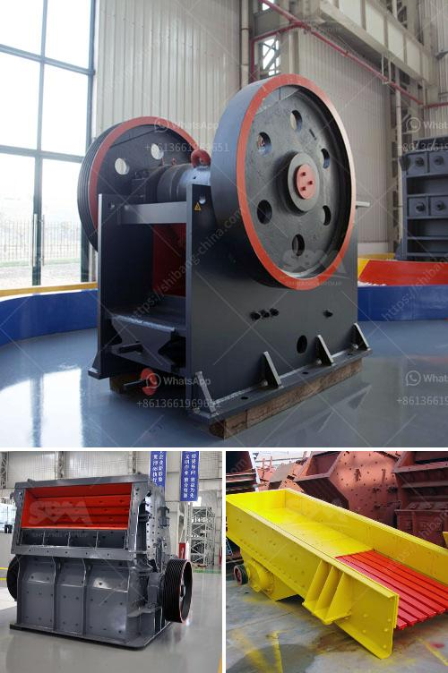

<h3>typical flow sheet for granite quarry</h3>
A granite quarry is a site where natural rock is extracted, processed, and refined to be used for various construction purposes. The flow sheet for a granite quarry typically includes several different processes such as:

1. Excavation: Granite is a very hard rock that needs to be cracked by explosives before it can be removed from the ground. Excavators and bulldozers are used to strip away the overburden and expose the granite deposit.

2. Blasting: Once the granite deposit is exposed, controlled explosions are carried out to break the rock into manageable pieces. This is done using dynamite or similar explosives. Blasting is carefully planned to ensure the safety of workers and nearby structures.

3. Transportation: After the granite is broken down, it needs to be transported to the processing plant. Large trucks or conveyors are used to move the granite from the quarry to the plant, minimizing the need for excessive manual labor.

4. Crushing: At the processing plant, the granite is crushed into smaller pieces using heavy machinery. The crushed granite pieces are then sent to a screening facility where different sizes of granite are sorted.

5. Grinding: After the initial screening process, the granite pieces are further refined through grinding. This process helps to remove any impurities, resulting in a smoother and more uniform texture.

6. Polishing: Polishing is an essential step for enhancing the appearance of granite. This involves smoothing the surface of the granite using an abrasive substance or polishing pads. The end result is a shiny and reflective surface.

7. Cutting and shaping: Once the granite is polished, it can be cut and shaped into various dimensions and forms. Diamond cutting tools are used to achieve precise cuts, while water jets or lasers can be used for intricate designs.

8. Finishing: After the granite is cut and shaped, additional finishing touches may be applied. This can include sealing the surface to protect against stains or adding decorative elements such as edge profiles or inlays.

9. Packaging and shipping: The final step in the flow sheet is packaging and shipping the finished granite products. The granite slabs or tiles are carefully stacked and packaged to prevent damage during transportation. They are then loaded onto trucks or shipping containers to be delivered to customers.

Overall, the flow sheet for a granite quarry involves a series of interconnected processes that transform the raw granite into a finished product. From excavation and blasting to crushing, grinding, and finishing, each step is crucial in ensuring the quality and usability of the granite. By following this typical flow sheet, granite quarries can efficiently produce high-quality granite products for a wide range of construction applications.
<h3>Contact us</h3><ul><li><strong>Whatsapp:&nbsp;<a href="https://wa.me/8613661969651">+8613661969651</a></strong></li><li><a href="https://swt.shibang-china.com/?git&amp;zhl&amp;typical flow sheet for granite quarry"><strong>Online Service(chat now)</strong></a></li></ul><h3>Related</h3><ul><li><a href='gold mill for sale in zimbabwe.md'>gold mill for sale in zimbabwe</a></li><li><a href='stone crusher price ton per day.md'>stone crusher price ton per day</a></li><li><a href='stone crushing machine manufacturer in japan.md'>stone crushing machine manufacturer in japan</a></li><li><a href='roller mill corrugation.md'>roller mill corrugation</a></li><li><a href='gypsum powder production process in india pdf.md'>gypsum powder production process in india pdf</a></li></ul>