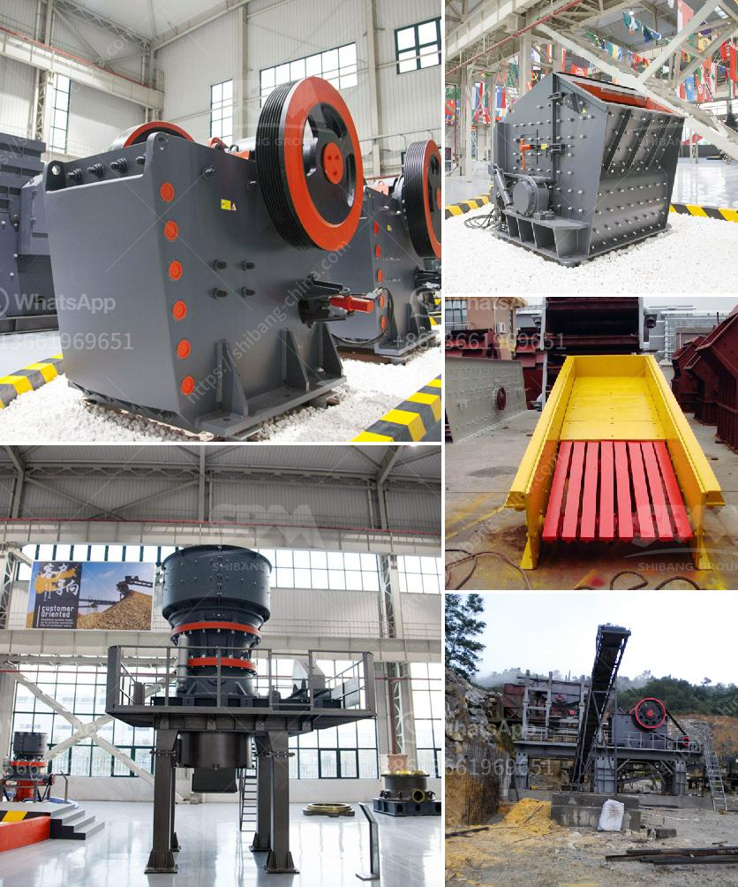

<h3>uk quarry crusher machinery manufacturers</h3>
The quarrying industry in the UK has a rich heritage that dates back to the Roman era. However, it is the advancements in technology and machinery that have catapulted it into the modern era. One crucial component of this industry is the quarry crusher machinery. These machines are responsible for breaking down large rocks into smaller, more manageable pieces, making them a vital part of the quarrying process.

For decades, UK quarry crusher machinery manufacturers have been at the forefront of innovation, continuously improving and developing new technologies to increase efficiency, productivity, and safety. Their dedication to excellence has cemented their reputation as world leaders in the field.

One of the key trends in the industry is the move towards greener and more sustainable practices. In response to increasing environmental concerns, quarry crusher machinery manufacturers in the UK have strived to develop machines that are more energy-efficient and emit fewer pollutants. By utilizing advanced technologies and materials, these manufacturers have succeeded in creating crushers that consume less energy while still maintaining high levels of productivity.

Furthermore, these manufacturers have also focused on enhancing the safety features of their machines. Quarrying can be a hazardous occupation, with the risk of accidents and injuries. Recognizing this, UK quarry crusher machinery manufacturers have integrated innovative safety mechanisms such as automated controls and remote monitoring systems into their crushers. These features not only protect the operators but also minimize downtime, ensuring a more efficient and profitable operation.

In terms of productivity, UK quarry crusher machinery manufacturers have made significant strides. They have introduced advanced automation systems that streamline operations and maximize output. These systems allow for remote control, real-time monitoring, and automatic adjustment of crusher settings, resulting in faster processing times and increased throughput. Additionally, they have improved the design and durability of their machines to withstand the harsh conditions of quarrying, minimizing downtime and maintenance costs.

Another area where UK manufacturers have excelled is in the development of mobile crushers. These machines are designed to be highly mobile and versatile, allowing operators to move them easily from one location to another. This flexibility is particularly beneficial in situations where the quarrying operation covers a large area or requires frequent relocation. With the advent of mobile crushers, quarrying companies have been able to reduce transportation costs and improve overall efficiency.

The success of UK quarry crusher machinery manufacturers can be attributed to a combination of factors. Firstly, the industry benefits from a highly skilled and experienced workforce that is dedicated to producing high-quality machinery. Moreover, the close collaboration between manufacturers, quarry operators, and regulatory authorities ensures that the machines meet stringent standards and regulations, guaranteeing their safety and performance.

In conclusion, UK quarry crusher machinery manufacturers are leading the way in innovation and efficiency. Their constant drive to improve and develop new technologies has revolutionized the quarrying industry, making it safer, greener, and more productive. With their emphasis on energy efficiency, safety, and productivity, these manufacturers continue to set the benchmark for the global quarry machinery market.
<h3>Contact us</h3><ul><li><strong>Whatsapp:&nbsp;<a href="https://wa.me/8613661969651">+8613661969651</a></strong></li><li><a href="https://swt.shibang-china.com/?git&amp;zhl&amp;uk quarry crusher machinery manufacturers"><strong>Online Service(chat now)</strong></a></li></ul><h3>Related</h3><ul><li><a href='new crushing machine in south africa.md'>new crushing machine in south africa</a></li><li><a href='mobile stone crusher south africa.md'>mobile stone crusher south africa</a></li><li><a href='industr gold mining equipment and prices.md'>industr gold mining equipment and prices</a></li><li><a href='harare changfa diesel engine.md'>harare changfa diesel engine</a></li><li><a href='kobe crushers singapore suppliers.md'>kobe crushers singapore suppliers</a></li></ul>