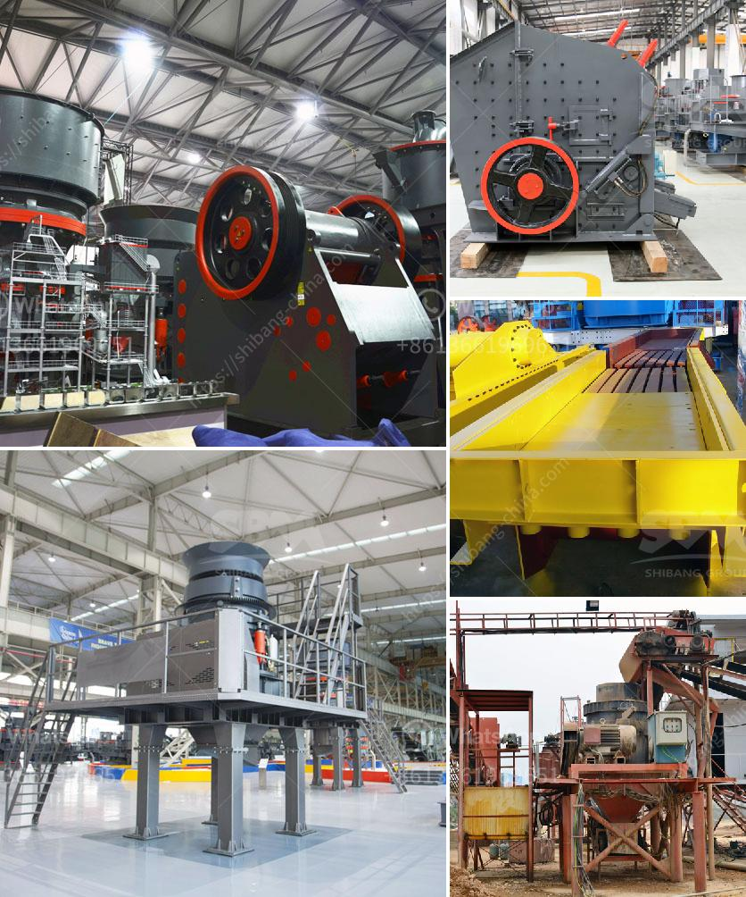

<h3>ultra fine grinding mill</h3>
The ultra-fine grinding mill is a popular grinding device in recent years because of its extensive application range and high efficiency. It has a wide range of applications in modern milling operations due to its innovative design and advanced technology.

In the past, the domestic ultra-fine grinding mill technology has achieved great development and progress, and the grinding technology has reached a mature stage. However, with the continuous progress of technology, the requirements for the fineness of materials are getting higher and higher, and the demand for ultra-fine grinding mills is also increasing.

The ultra-fine grinding mill is mainly suitable for processing materials with low hardness and low humidity. It can grind various non-flammable and explosive brittle materials with Mohs hardness below 7, such as calcite, limestone, dolomite, kaolin, bentonite, talc, mica, magnesite, illite, pyrophyllite , vermiculite, sepiolite, attapulgite, rectorite, diatomaceous earth, barite, gypsum, alum, graphite, fluorite, phosphate rock, potassium ore, pumice, etc.

The ultra-fine grinding mill is mainly composed of a main machine, a blower, an ultra-fine analyzer, a cyclone powder collector, a bag filter, and a connecting duct. The main machine is composed of a grinding roller assembly, a grinding ring, a blade, a cover casing, and a motor.

The grinding roller assembly is one of the critical components of the ultra-fine grinding mill. It is mainly composed of a shaft, a sleeve, a grinding roller, a bearing housing, and a bearing. The grinding roller is tightly pressed on the grinding ring by springs, and the rotation of the main machine drives the grinding roller to rotate.

The material entering the ultra-fine grinding mill is crushed by the blade, and then enters the grinding roller assembly for grinding. The crushed material is classified by the ultra-fine analyzer, and the qualified fine powder enters the cyclone powder collector with the airflow for collection. The unqualified coarse powder falls into the grinding chamber for regrinding. The collected fine powder is discharged through the powder outlet, and the exhaust gas is purified by the bag filter and discharged through the air outlet.

In recent years, with the increasing demand for ultra-fine powders in the market, the ultra-fine grinding mill has become an indispensable equipment for various industries. It has the advantages of wide application range, high grinding efficiency, and low energy consumption. It can effectively reduce the production cost and improve the economic benefits for enterprises.

In conclusion, the ultra-fine grinding mill is an ideal equipment for the processing of ultra-fine powders. It has strong adaptability to materials, high grinding efficiency, and low energy consumption. With the continuous improvement and development of technology, the ultra-fine grinding mill will play a more significant role in the future.
<h3>Contact us</h3><ul><li><strong>Whatsapp:&nbsp;<a href="https://wa.me/8613661969651">+8613661969651</a></strong></li><li><a href="https://swt.shibang-china.com/?git&amp;zhl&amp;ultra fine grinding mill"><strong>Online Service(chat now)</strong></a></li></ul><h3>Related</h3><ul><li><a href='stone crusher machine price list zambia.md'>stone crusher machine price list zambia</a></li><li><a href='portable stone crushers.md'>portable stone crushers</a></li><li><a href='what is the cost of crusher.md'>what is the cost of crusher</a></li><li><a href='drawing for raymond mill.md'>drawing for raymond mill</a></li><li><a href='small scale stone crusher machine in kenya.md'>small scale stone crusher machine in kenya</a></li></ul>