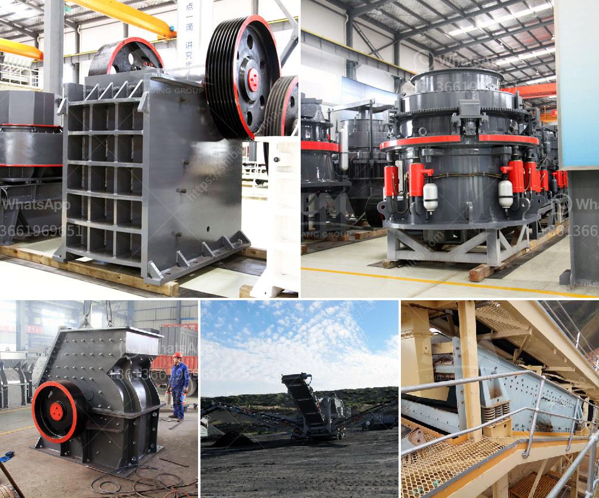

<h3>ultra fine mill manufacturers in india</h3>
Ultrafine mill is a popular grinding equipment in the modern industrial production market. It is efficient, energy-saving, and environmentally friendly, making it a widely used tool to grind various minerals. India, as one of the world's largest mineral resources, has a strong demand for ultrafine mills. Therefore, there are numerous ultrafine mill manufacturers in India. In this article, we will discuss some of the top manufacturers and their products.

One of the leading manufacturers of ultrafine mills in India is Laxmi Minerals. With over 20 years of experience in the industry, Laxmi Minerals has gained a reputation for producing high-quality grinding equipment. Their ultrafine mills are used in various industries including mining, metallurgy, cement, construction, and chemical engineering. Laxmi Minerals' ultrafine mills are known for their high output, low energy consumption, and easy maintenance.

Another well-known manufacturer in India is Fab-Tech Manufacturers. They specialize in designing and manufacturing grinding machines, including ultrafine mills. Fab-Tech's ultrafine mills are designed to grind a wide range of materials, such as minerals, ores, chemicals, and many more. The company's commitment to quality and customer satisfaction has made them a preferred choice among industrial manufacturers in India.

Furthermore, we have Gupta Grinding Mills, a prominent manufacturer based in India. Gupta Grinding Mills offers a variety of ultrafine mills suitable for grinding different types of minerals. Their mills are equipped with advanced technology, ensuring precision grinding and efficient performance. Gupta Grinding Mills' products are widely used in the paint, paper, plastic, and pharmaceutical industries.

One more notable manufacturer in India is Kinc Mineral Technologies. Kinc Mineral Technologies produces high-quality ultrafine mills that are widely used in the mineral processing industry. Their mills are designed to grind various minerals, such as limestone, kaolin, calcium carbonate, and many more. Kinc Mineral Technologies' ultrafine mills are known for their reliability, durability, and energy efficiency.

In addition to these manufacturers, there are many other companies producing ultrafine mills in India. Each manufacturer has its unique features and advantages, catering to different customer needs. The competition among these manufacturers has led to continuous innovations and improvements in ultrafine mill technology, ensuring high-quality products for Indian customers.

With the increasing demand for ultrafine mills in India, the market is expected to grow significantly in the coming years. This growth can be attributed to the rapid development of various industries, such as mining, construction, and manufacturing. Manufacturers are constantly investing in research and development to enhance their products and meet the diverse requirements of customers in India.

In conclusion, India is home to several reputable ultrafine mill manufacturers. These manufacturers offer a wide range of high-quality and efficient grinding machines that cater to various industries. The industry's growth potential is immense, driven by the country's abundant mineral resources and the increasing demand for ultrafine mills. With continuous technological advancements, the future of ultrafine mill manufacturing in India looks promising.
<h3>Contact us</h3><ul><li><strong>Whatsapp:&nbsp;<a href="https://wa.me/8613661969651">+8613661969651</a></strong></li><li><a href="https://swt.shibang-china.com/?git&amp;zhl&amp;ultra fine mill manufacturers in india"><strong>Online Service(chat now)</strong></a></li></ul><h3>Related</h3><ul><li><a href='limestone processing in nigeria.md'>limestone processing in nigeria</a></li><li><a href='iron crushing plant for sale.md'>iron crushing plant for sale</a></li><li><a href='quotation for impact crusher.md'>quotation for impact crusher</a></li><li><a href='grinding feldspar for glazes.md'>grinding feldspar for glazes</a></li><li><a href='hammer mills for sale in zimbabwe.md'>hammer mills for sale in zimbabwe</a></li></ul>