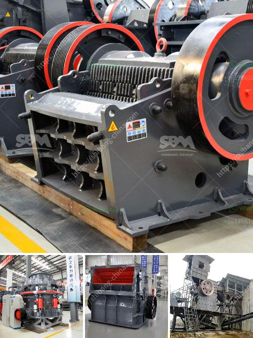

<h3>ultra grinder service center mumbai</h3>
When it comes to kitchen appliances, Ultra is a name that has been trusted by households across India. Known for their high-quality products and top-notch customer service, Ultra has established a strong presence in the market. And when it comes to service centers, Ultra Grinder Service Center in Mumbai is a one-stop destination for all your servicing needs.

Convenience is the key factor that sets Ultra Grinder Service Center apart from the rest. With multiple centers spread across Mumbai, they ensure that every customer can access their services with ease. Whether you reside in the suburbs or the heart of the city, there is a service center close to you. This saves you the hassle of travelling long distances for maintenance or repairs.

What makes Ultra Grinder Service Center stand out is their team of skilled technicians. With years of experience and in-depth knowledge about Ultra products, they understand the intricacies involved in servicing these appliances. This expertise allows them to diagnose and resolve issues quickly, ensuring minimal downtime for your grinder.

Customer satisfaction is at the core of Ultra Grinder Service Center’s approach. They prioritize timely service, ensuring that your grinder is up and running in no time. Additionally, they use only genuine spare parts for repairs, guaranteeing the longevity of your appliance. This commitment to quality and reliability sets them apart from unauthorized service centers that may compromise on the authenticity of spare parts.

To further enhance customer experience, Ultra Grinder Service Center in Mumbai offers doorstep servicing. If you are unable to visit their center, they will send a qualified technician to your home. This saves you time and effort, allowing you to continue with your daily routine uninterrupted.

In conclusion, Ultra Grinder Service Center in Mumbai is a trusted destination for all your Ultra grinder servicing needs. With their efficient and reliable solutions, they ensure that your appliance is in top-notch condition, providing you with a seamless kitchen experience. So, the next time you face any issues with your Ultra grinder, don’t hesitate to reach out to their service center and let their experts take care of it for you.
<h3>Contact us</h3><ul><li><strong>Whatsapp:&nbsp;<a href="https://wa.me/8613661969651">+8613661969651</a></strong></li><li><a href="https://swt.shibang-china.com/?git&amp;zhl&amp;ultra grinder service center mumbai"><strong>Online Service(chat now)</strong></a></li></ul><h3>Related</h3><ul><li><a href='type of product manufactured vertical mills of india.md'>type of product manufactured vertical mills of india</a></li><li><a href='cost of 500 tonnes per day cement plant ecuador.md'>cost of 500 tonnes per day cement plant ecuador</a></li><li><a href='coal mill grinding media wear rate.md'>coal mill grinding media wear rate</a></li><li><a href='cement industry process.md'>cement industry process</a></li><li><a href='gold mining equipments manufacturers.md'>gold mining equipments manufacturers</a></li></ul>