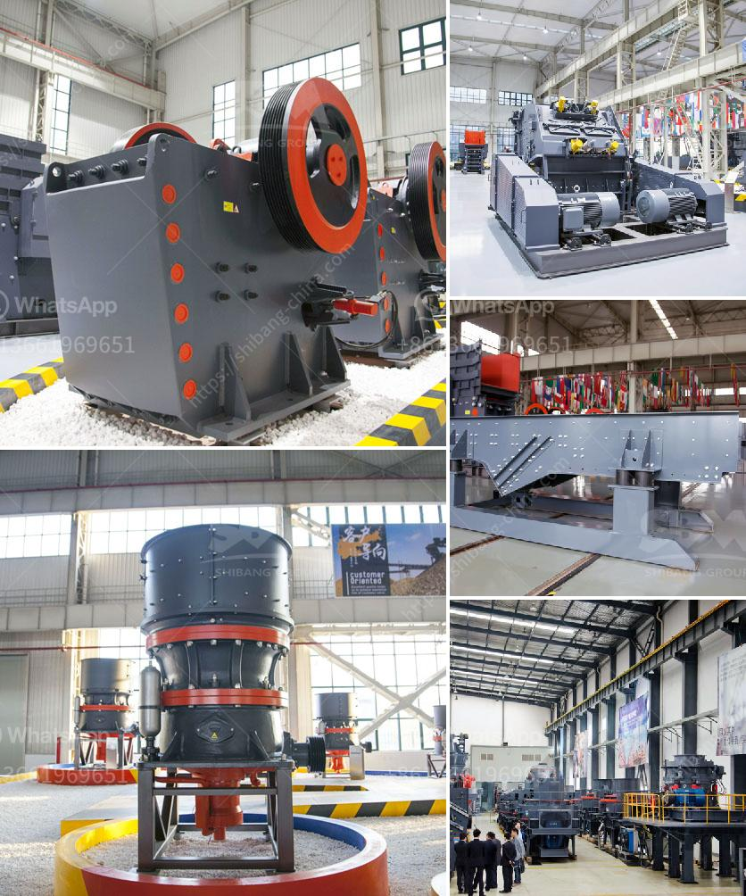

<h3>ultrafine grinder for producing powder</h3>
In the world of modern technology, grinding equipment plays a vital role in various industries. However, when it comes to producing superfine powders, there is no better tool than an ultrafine grinder. With its exceptional efficiency and precision, this equipment has proven to be a game-changer in the powder production process.

The main function of an ultrafine grinder is to reduce solid materials into powder form. Whether it is minerals, chemicals, or even pharmaceuticals, this machine can handle them all. Its advanced grinding mechanism ensures a consistent and uniform particle size, which is essential for several applications.

One of the key advantages of an ultrafine grinder is its ability to produce powders with extreme fineness. Unlike conventional grinders, which may not be able to achieve such desirable results, this machine boasts remarkable precision in grinding. The ultrafine particles produced are extremely small, ranging from a few microns down to submicron levels.

Another important feature of the ultrafine grinder is its versatility. With adjustable grinding parameters, this equipment can cater to a wide range of materials and applications. From soft to hard materials, it can handle them all with ease. Moreover, it offers greater control over the size and distribution of particles, allowing manufacturers to produce powders with specific characteristics.

In addition to its efficiency and versatility, an ultrafine grinder also offers numerous benefits for manufacturers. Its compact design and low energy consumption make it a cost-effective solution. Furthermore, it generates minimal heat during the grinding process, ensuring that the heat-sensitive materials remain unaffected.

In conclusion, the ultrafine grinder has revolutionized the way powders are produced. Its exceptional efficiency, precision, and versatility make it the perfect tool for various industries. Whether it is for pharmaceuticals, chemicals, or any other application, this machine delivers consistent and high-quality results. So, if you are in need of superfine powders, look no further than an ultrafine grinder.
<h3>Contact us</h3><ul><li><strong>Whatsapp:&nbsp;<a href="https://wa.me/8613661969651">+8613661969651</a></strong></li><li><a href="https://swt.shibang-china.com/?git&amp;zhl&amp;ultrafine grinder for producing powder"><strong>Online Service(chat now)</strong></a></li></ul><h3>Related</h3><ul><li><a href='mobile hammer crusher.md'>mobile hammer crusher</a></li><li><a href='cost of roller crusher.md'>cost of roller crusher</a></li><li><a href='puzzolana crusher malaysia.md'>puzzolana crusher malaysia</a></li><li><a href='ball mills for calcium.md'>ball mills for calcium</a></li><li><a href='roll ball mill manufacturers.md'>roll ball mill manufacturers</a></li></ul>