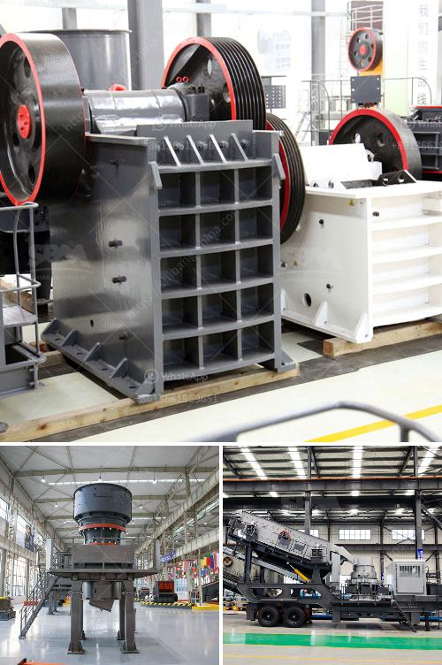

<h3>ultrafine mill crusher price in india</h3>
The economic climate in India has led to an increase in the demand for high-quality machinery, such as ultrafine mill crushers. These machines have become crucial in the mining and construction industries as they can efficiently grind, crush, and shape materials. As a result, manufacturers have introduced a wide range of products, each with its unique features and specifications. However, one of the most important factors that influence a buyer's decision is the price.

The price of an ultrafine mill crusher can vary significantly based on several factors. First and foremost, the brand and reputation of the manufacturer play a crucial role. Well-established and renowned brands tend to have higher prices compared to new or lesser-known manufacturers. This is because established brands invest heavily in research and development, ensuring that their products are of the highest quality and meet industry standards.

Another factor that affects the price is the specifications of the machine. Ultrafine mill crushers come in various sizes, capacities, and power ratings. Machines with higher capacities and power ratings generally have higher prices. Additionally, the type of materials that can be processed by the crusher also affects the price. Some crushers are designed specifically for the processing of certain materials, such as limestone or granite, and these specialized machines tend to be more expensive.

The location of the manufacturer can also impact the price of the ultrafine mill crusher. In India, for example, manufacturers located in metropolitan cities such as Mumbai or Delhi may have higher production costs due to factors like higher labor and real estate costs. This could result in higher prices compared to manufacturers located in smaller cities or rural areas.

Lastly, market competition can affect the price of a product. If there are several manufacturers producing similar ultrafine mill crushers, they may engage in price wars to attract customers. This competition can lead to lower prices, benefiting the buyers. On the other hand, if a manufacturer dominates the market, they may have more control over the pricing, resulting in higher prices.

In conclusion, the price of an ultrafine mill crusher in India can vary based on the brand, specifications, location of the manufacturer, and market competition. Buyers should consider their specific needs and budget when evaluating different options. While price is an important factor, it is equally crucial to ensure that the machine meets the required quality standards and provides the necessary features for efficient processing of materials. By carefully evaluating these factors, buyers can make an informed decision and select the best ultrafine mill crusher for their needs.
<h3>Contact us</h3><ul><li><strong>Whatsapp:&nbsp;<a href="https://wa.me/8613661969651">+8613661969651</a></strong></li><li><a href="https://swt.shibang-china.com/?git&amp;zhl&amp;ultrafine mill crusher price in india"><strong>Online Service(chat now)</strong></a></li></ul><h3>Related</h3><ul><li><a href='cement plants suppliers from china.md'>cement plants suppliers from china</a></li><li><a href='vrm and ball mill circulating load.md'>vrm and ball mill circulating load</a></li><li><a href='bauxite calcination plant cost in india.md'>bauxite calcination plant cost in india</a></li><li><a href='mobile crushers on tracks.md'>mobile crushers on tracks</a></li><li><a href='gold mining industry in tanzania.md'>gold mining industry in tanzania</a></li></ul>