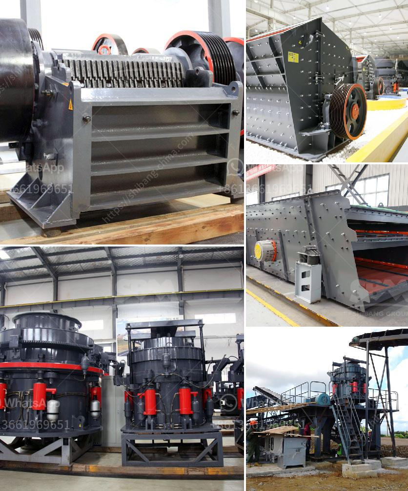

<h3>ultrafine vertical roller mill</h3>
In recent years, the demand for grinding technology has been increasing due to the rapid development of the mining industry. To meet the ever-growing demand, manufacturers have been striving to develop more efficient and advanced grinding mills. One such revolutionary solution is the ultrafine vertical roller mill.

The ultrafine vertical roller mill is a new type of grinding machine designed to meet the needs of ultrafine grinding applications. This mill is equipped with a high-efficiency and low-cost ultrafine powder processing system that can achieve large-scale production with continuous operation.

The key feature of this mill is its vertical grinding design. This design not only reduces the floor space required for the equipment but also improves the overall grinding efficiency. The vertical arrangement increases the contact area between the grinding roller and the material, ensuring a more uniform and efficient grinding process. Additionally, the vertical arrangement allows for better airflow and heat dissipation, preventing the material from overheating and ensuring the quality of the final product.

Another notable feature of the ultrafine vertical roller mill is its advanced classification system. The mill is equipped with a specially designed classifier that finely classifies the ground material according to its size and particle shape. This classification system ensures that the fine particles are efficiently separated from the coarse particles, resulting in a consistent and high-quality final product.

Furthermore, this mill is equipped with a multi-function sealing device that effectively prevents dust leakage and ensures a clean working environment. This feature is particularly crucial in industries where dust control is a primary concern, such as mining and metallurgy.

The ultrafine vertical roller mill also offers several advantages compared to traditional grinding mills. Firstly, it has a wider range of application. This mill is suitable for grinding a variety of materials, including cement, raw materials, clinker, coal, limestone, clay, and more. Secondly, it has a higher grinding efficiency and lower energy consumption. The vertical roller mill can achieve ultrafine grinding with a specific energy consumption significantly lower than that of a ball mill. Lastly, it offers greater flexibility in terms of control and operation. The mill can be easily adjusted and optimized according to the specific requirements of the material being ground.

In conclusion, the ultrafine vertical roller mill is a revolutionary solution for grinding applications. With its vertical grinding design, advanced classification system, and efficiency-enhancing features, this mill offers superior performance, energy efficiency, and product quality. Its wide range of applications and flexible operation further solidify its place as a leading grinding technology in the industry. Whether in mining, metallurgy, or other grinding-intensive industries, the ultrafine vertical roller mill is a reliable and cost-effective solution for achieving high-quality and efficient grinding results.
<h3>Contact us</h3><ul><li><strong>Whatsapp:&nbsp;<a href="https://wa.me/8613661969651">+8613661969651</a></strong></li><li><a href="https://swt.shibang-china.com/?git&amp;zhl&amp;ultrafine vertical roller mill"><strong>Online Service(chat now)</strong></a></li></ul><h3>Related</h3><ul><li><a href='recycled glass price per tonne in durban.md'>recycled glass price per tonne in durban</a></li><li><a href='basalt impact crusher price.md'>basalt impact crusher price</a></li><li><a href='25 tph vsi crushers.md'>25 tph vsi crushers</a></li><li><a href='3 roller pulvarising mill manufacturer.md'>3 roller pulvarising mill manufacturer</a></li><li><a href='cost of malaysia mobile crusher in india.md'>cost of malaysia mobile crusher in india</a></li></ul>