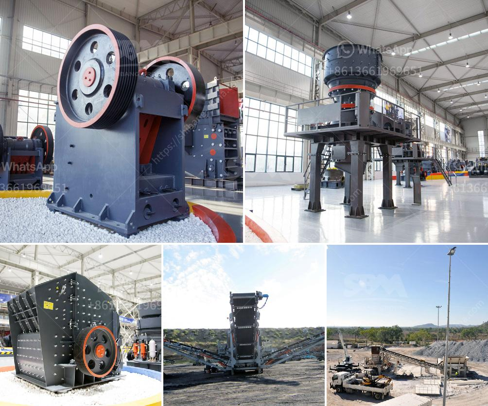

<h3>ultrafiner grinding mill</h3>
Grinding mills have been used for centuries in various industries to grind and reduce particle size. However, the conventional grinding mills often faced limitations in terms of achieving ultrafine particle sizes and efficient energy utilization. That's where ultrafine grinding mills come into the picture.

Ultrafine grinding mills, also known as ultrafine grinders, provide groundbreaking solutions for grinding various materials down to ultrafine particle sizes. These mills are designed to meet the growing demand for finely ground materials in various industries such as mining, pharmaceuticals, ceramics, and more. 

One of the key features of ultrafine grinding mills is their ability to produce ultrafine particles sizes ranging from a few micrometers down to a few nanometers. This ultrafine grinding process is achieved through the use of high-speed grinding mechanisms, advanced classification systems, and precise control of grinding parameters.

One popular type of ultrafine grinding mill is the jet mill, which utilizes compressed air or gas to accelerate particles and achieve ultrafine grinding. Another commonly used type is the ball mill, which relies on impact and attrition forces to grind materials to fine powder.

Ultrafine grinding mills not only provide remarkable particle size reduction capabilities but also offer enhanced energy efficiency. These mills are optimized for grinding efficiency, reducing the energy consumption required for grinding, and thus reducing the carbon footprint of grinding processes.

In addition to their particle size reduction capabilities and energy efficiency, ultrafine grinding mills are renowned for their versatility. They can grind a wide range of materials, including minerals, chemicals, pigments, and even food products. This versatility makes ultrafine grinding mills a go-to choice for many industries looking to enhance their product quality and performance.

In conclusion, ultrafine grinding mills have revolutionized the way we grind materials, offering unprecedented levels of particle size reduction and energy efficiency. They are an essential tool in many industries, enabling the production of ultrafine particles and the enhancement of product quality. As technology continues to advance, we can only expect further advancements in ultrafine grinding mills, paving the way for more efficient and sustainable grinding processes.
<h3>Contact us</h3><ul><li><strong>Whatsapp:&nbsp;<a href="https://wa.me/8613661969651">+8613661969651</a></strong></li><li><a href="https://swt.shibang-china.com/?git&amp;zhl&amp;ultrafiner grinding mill"><strong>Online Service(chat now)</strong></a></li></ul><h3>Related</h3><ul><li><a href='process of quarrying limestone crusher.md'>process of quarrying limestone crusher</a></li><li><a href='mobile screening plant for sale.md'>mobile screening plant for sale</a></li><li><a href='stone crusher portable machine.md'>stone crusher portable machine</a></li><li><a href='crushing machine for chromium and chromite ore.md'>crushing machine for chromium and chromite ore</a></li><li><a href='stone crusher in thailand.md'>stone crusher in thailand</a></li></ul>