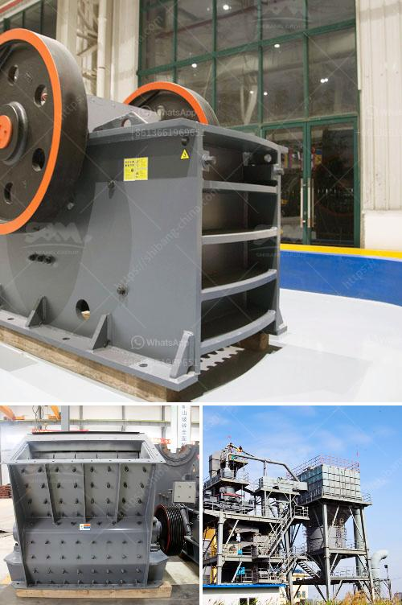

<h3>used brick making machine for sale</h3>
If you are in the construction business or looking to undertake a project that involves bricklaying, finding a reliable and cost-effective source of bricks is essential. One option that has gained popularity in recent years is purchasing a used brick making machine. With the rise of recycling and sustainable practices, using recycled materials has become a viable solution for various industries, including brick production.

A used brick making machine for sale can be an excellent investment for businesses and individuals alike. These machines offer a way to produce high-quality bricks at a fraction of the cost of buying new ones. They are ideal for small to medium-sized projects, such as building houses, schools, or small commercial buildings.

One of the main advantages of a used brick making machine is its affordability. Compared to purchasing a new machine, the cost of a used one can be significantly lower. This is especially advantageous for startups or businesses with a limited budget. Additionally, the initial investment pays off quickly as the machine can produce a substantial number of bricks in a short time.

Another benefit is the environmental aspect of using recycled materials. By opting for a used brick making machine, you are contributing to the reduction of waste and carbon footprint. These machines are designed to crush and reuse old bricks or other construction materials to create new ones. This process not only saves resources but also reduces the need for raw materials, such as clay or concrete.

When considering purchasing a used brick making machine, it is essential to do thorough research and inspect the machine carefully. Take note of its condition, maintenance history, and any potential repairs or parts that may need replacement. It is also advisable to inquire about warranty or after-sales services to ensure a smooth operation.

In conclusion, a used brick making machine for sale can be a cost-effective and environmentally conscious solution for brick production. By investing in such a machine, you not only save money but also contribute to the sustainable practices in the construction industry. So, if you are in need of bricks for your project, consider exploring the option of a used brick making machine.
<h3>Contact us</h3><ul><li><strong>Whatsapp:&nbsp;<a href="https://wa.me/8613661969651">+8613661969651</a></strong></li><li><a href="https://swt.shibang-china.com/?git&amp;zhl&amp;used brick making machine for sale"><strong>Online Service(chat now)</strong></a></li></ul><h3>Related</h3><ul><li><a href='granular barite production process flow.md'>granular barite production process flow</a></li><li><a href='conveyor belt for crusher china.md'>conveyor belt for crusher china</a></li><li><a href='berat mobile screen mobile crusher.md'>berat mobile screen mobile crusher</a></li><li><a href='list of stone crusher equipment.md'>list of stone crusher equipment</a></li><li><a href='diamond making machines germany.md'>diamond making machines germany</a></li></ul>