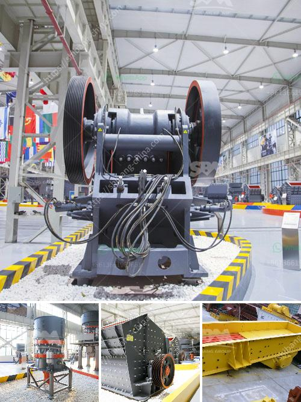

<h3>used clay brick machine for sale in germany</h3>
Germany is one of the world's leading economies known for its quality engineering and craftsmanship. With a rich history of innovation and automation in various industries, German machinery is highly sought after globally. The brick-making industry in Germany is no exception, as German manufacturers provide efficient and reliable brick-making machines in both new and used conditions. In this article, we will delve into the options available for used clay brick machines for sale in Germany.

The demand for clay brick machines in Germany has been consistent over the years owing to the high demand for quality bricks in the construction industry. Many brick manufacturers in the country prefer investing in used clay brick machines as they can acquire them at a lower cost compared to new ones. These used machines are often refurbished by manufacturers or individual sellers to ensure they are in optimal working condition before being put up for sale.

One of the significant advantages of opting for used clay brick machines is the cost savings. Depending on factors such as age, condition, and brand, used machines can be purchased at a fraction of the cost of new ones. This allows brick manufacturers to invest in other areas of their business or upgrade their existing machinery without incurring excessive expense.

Furthermore, used clay brick machines for sale in Germany offer a shorter lead time compared to ordering new machines. With new machines, manufacturers sometimes have to wait for months or even longer for the complete manufacturing and shipping process, whereas used machines are readily available for immediate purchase. This quick turnaround time enables brick manufacturers to meet the demands of their clients promptly, especially during peak construction seasons.

When searching for used clay brick machines for sale in Germany, potential buyers have several avenues to explore. Online marketplaces and classified ads websites allow sellers to showcase their used machinery inventory to a global audience. These platforms provide detailed descriptions, specifications, and often include images or videos to provide a comprehensive overview of the machines on offer. Interested buyers can directly get in touch with the sellers to negotiate the price and arrange for inspections if necessary.

Apart from online platforms, brick manufacturers can also reach out to local machinery dealers or manufacturers who may have used clay brick machines available. These dealers often have a wide network of connections in the brick-making industry and can assist in sourcing the right machine that fits the buyer's requirements.

However, it is crucial for potential buyers to conduct due diligence before finalizing a purchase. This involves a thorough inspection of the machine's condition, its maintenance history, and ensuring that all necessary components and accessories are included. Buyers should also inquire about warranty or after-sales support from the seller to address any unforeseen issues that may arise.

In conclusion, used clay brick machines for sale in Germany offer a cost-effective and time-efficient solution for brick manufacturers looking to expand or upgrade their production capabilities. With a wide range of options available through online platforms, local dealers, and manufacturers, buyers can find the perfect machine to meet their specific requirements. By investing in used machinery, brick manufacturers can enhance their competitiveness in the market while ensuring quality construction materials continue to be produced in Germany.
<h3>Contact us</h3><ul><li><strong>Whatsapp:&nbsp;<a href="https://wa.me/8613661969651">+8613661969651</a></strong></li><li><a href="https://swt.shibang-china.com/?git&amp;zhl&amp;used clay brick machine for sale in germany"><strong>Online Service(chat now)</strong></a></li></ul><h3>Related</h3><ul><li><a href='stone crushers for sale in riyadh.md'>stone crushers for sale in riyadh</a></li><li><a href='mobile crusher manufacturers.md'>mobile crusher manufacturers</a></li><li><a href='used nd hand coal crusher sizer.md'>used nd hand coal crusher sizer</a></li><li><a href='alluvial gold mining project proposal.md'>alluvial gold mining project proposal</a></li><li><a href='blast furnace slag grinding machine india.md'>blast furnace slag grinding machine india</a></li></ul>