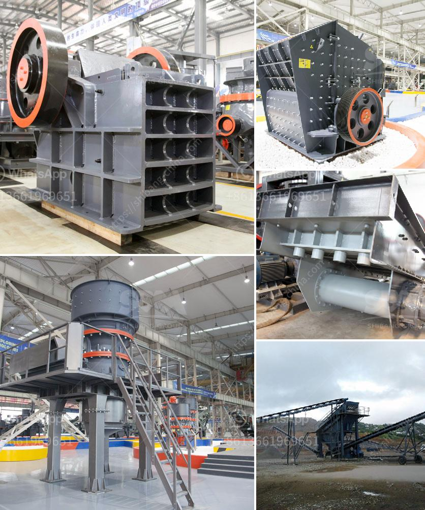

<h3>used clinker grinding mill for sale</h3>
Clinker grinding is the important operation is cement production line. The electrical energy consumed in cement production is approximately 110 kWh/tonne, and around 40% of this energy is consumed for clinker grinding. Nowadays, many cement plants are adopting the new technology of dry method cement production, which requires the grinding of clinker to its particle size from 30-50mm to less than 3mm.

A used clinker grinding mill may be a viable option to reduce costs. Clinker grinding refers to the process of grinding the clinker to a powder. Consisting of cement mixed with gypsum and other additives, it is the final product produced in cement plants. Grinding milling systems enable finer grinding of clinker ores, enabling consistent cement quality. They also improve cement clinker burning efficiency.

When buying a used clinker grinding mill, it is important to ensure that its condition is still excellent. This ensures that the mill will be capable of handling the grinding process efficiently and effectively. Checking for any damage, wear, or signs of corrosion is crucial. Additionally, the motor, bearings, and other moving parts should be checked for smooth operation.

In addition to condition, factors to consider when purchasing a used clinker grinding mill include capacity requirements, energy consumption, and the cost of maintenance. The mill's capacity should be able to meet the production requirements of the cement plant. Energy consumption is directly related to the efficiency of the mill, so choosing a well-designed and energy-efficient mill is beneficial for long-term cost savings. Lastly, the cost of maintenance should be taken into account to ensure that it is manageable and within budget.

In conclusion, when considering a used clinker grinding mill for sale, it is essential to thoroughly inspect its condition, capacity, energy consumption, and maintenance requirements. By doing so, one can make an informed decision and potentially acquire a cost-effective and efficient mill for their cement production needs.
<h3>Contact us</h3><ul><li><strong>Whatsapp:&nbsp;<a href="https://wa.me/8613661969651">+8613661969651</a></strong></li><li><a href="https://swt.shibang-china.com/?git&amp;zhl&amp;used clinker grinding mill for sale"><strong>Online Service(chat now)</strong></a></li></ul><h3>Related</h3><ul><li><a href='ball mill for mineral grinding india.md'>ball mill for mineral grinding india</a></li><li><a href='quartz grits plant machinery.md'>quartz grits plant machinery</a></li><li><a href='crusher dealers in kenya.md'>crusher dealers in kenya</a></li><li><a href='washing plant for silica.md'>washing plant for silica</a></li><li><a href='asphalt crushing machine capacity 15 ton hour.md'>asphalt crushing machine capacity 15 ton hour</a></li></ul>