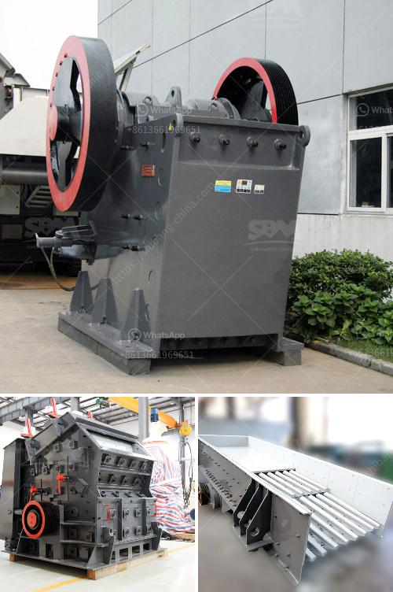

<h3>used coal power plant for sale</h3>
As the world strives towards a greener future, the decommissioning of coal power plants has become more prevalent. However, while many countries aim to phase out coal-fired power generation, there are still opportunities arising from the sale of used coal power plants. This article delves into the potential benefits, challenges, and considerations associated with the purchase of used coal power plants.

One of the main advantages of investing in a used coal power plant is the potential for cost savings. These plants are often available for a significantly lower price compared to building new facilities from scratch. Furthermore, the existing infrastructure can reduce both construction and operational costs in the long run.

Used coal power plants can provide a quick and reliable solution to meet electricity demands, especially in regions with limited access to alternative energy sources or facing an energy transition period. These plants can ensure stability in the power grid and allow additional time for the deployment of renewable energy technologies.

Coal power plants that are being decommissioned often have outdated technology, making them less efficient and environmentally friendly. However, potential buyers can leverage this situation to modernize and upgrade the plant's machinery, enhancing efficiency and reducing greenhouse gas emissions. Retrofitting can help align the plant's operation with stricter environmental regulations, promoting sustainable energy generation.

Investors interested in used coal power plants can also consider alternative fuel sources to reduce carbon emissions. Co-firing the plant with biomass, such as agricultural waste or sustainably sourced wood pellets, can be an effective transitional strategy. This approach allows power plants to simultaneously produce energy from both coal and biomass, gradually reducing the reliance on fossil fuels.

While the potential benefits of purchasing a used coal power plant are substantial, certain challenges and considerations must be carefully evaluated. First and foremost, environmental impact is a major concern. Analyzing the plant's emissions record and conducting an environmental impact assessment are crucial steps to ensure compliance with existing regulations.

Additionally, assessing the condition of the plant and the availability of spare parts is essential to avoid unexpected maintenance costs or downtime. Buyers should also consider the plant's operational history, efficiency, and overall reliability to determine if it suits their requirements.

The sale of used coal power plants offers a unique opportunity for investors seeking cost-effective solutions while contributing to the global energy transition. By retrofitting, utilizing alternative fuels, and implementing advanced technologies, these plants can evolve into more sustainable energy sources. However, it is vital to carefully consider the environmental impact, plant condition, and operational history to ensure a successful and responsible investment. As the world continues its shift towards cleaner energy systems, the potential of used coal power plants for sale lies in their adaptability and ability to bridge the gap between traditional and renewable energy sources.
<h3>Contact us</h3><ul><li><strong>Whatsapp:&nbsp;<a href="https://wa.me/8613661969651">+8613661969651</a></strong></li><li><a href="https://swt.shibang-china.com/?git&amp;zhl&amp;used coal power plant for sale"><strong>Online Service(chat now)</strong></a></li></ul><h3>Related</h3><ul><li><a href='how to set up a quarry plant.md'>how to set up a quarry plant</a></li><li><a href='gypsum board manufacturing factory in turkey.md'>gypsum board manufacturing factory in turkey</a></li><li><a href='clinker grinding plant manufacturers germany.md'>clinker grinding plant manufacturers germany</a></li><li><a href='large capacity sand screening price for sale.md'>large capacity sand screening price for sale</a></li><li><a href='price on a mining ball mill 10 tons per hour.md'>price on a mining ball mill 10 tons per hour</a></li></ul>