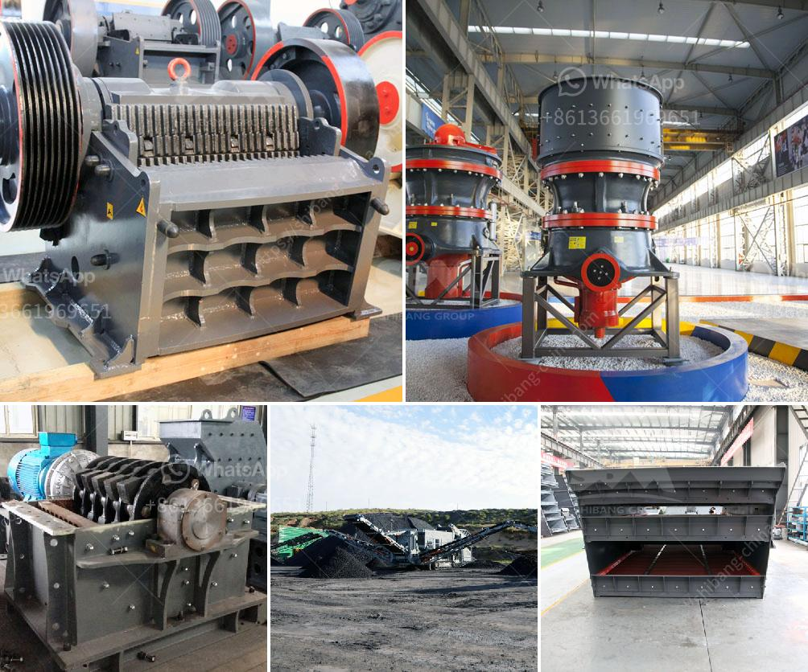

<h3>used coal washing plants for sale in pakistan</h3>
Coal is an essential fuel utilized worldwide for the production of electricity and heat. Coal is also important for other industrial purposes, such as refining metals, manufacturing chemicals, and producing synthetic materials. Pakistan is home to vast reserves of coal, discovered in the 1750s, primarily in the Thar desert and Balochistan province. As the country seeks to harness this energy source efficiently, used coal washing plants are emerging as an attractive option for sale.

Coal washing plants tend to be located close to coal mines for logistical reasons. Before the industrial revolution, coal was mined manually and manually separated from impurities. It was not until the 1840s that coal washing—a process of separating impurities from coal—was introduced to enhance the quality and quantity of coal. Coal washing plants became prevalent during the 1920s and 1930s as demand for coal skyrocketed.

Pakistan's coal reserves have largely remained untapped due to various reasons, including a lack of infrastructure, expertise, and technological capabilities. However, with the arrival of used coal washing plants, the country now stands to expand its energy mix and cater to the growing energy demands.

Used coal washing plants offer an effective solution in addressing the challenge of high ash content in coal. The ash content, sometimes as high as 50%, makes the coal less efficient, contributing to increased pollution and environmental degradation. By utilizing coal washing plants, the ash content can be significantly reduced, thereby enhancing the energy output and reducing the environmental impact of coal-based power generation.

These used plants feature a variety of sophisticated machinery and equipment designed to separate impurities from coal. The coal is crushed to a specific size and then subjected to a dense medium separation process. This process involves immersing the coal in a suspension of finely ground magnetite or ferrosilicon to separate the heavier impurities. The clean coal is then dewatered and transported for further processing or direct use.

Investing in used coal washing plants offers several advantages for Pakistan. Firstly, it can help the country achieve energy self-sufficiency, reducing its dependence on costly fossil fuel imports. This, in turn, can bolster the economy by freeing up valuable foreign exchange reserves. Additionally, by upgrading the quality of coal through washing, the efficiency of coal-fired power plants can be improved, resulting in reduced emissions and lower carbon footprint.

Furthermore, the installation of used coal washing plants can provide employment opportunities, both in terms of skilled labor and technical expertise. Local workers can be trained in operating and maintaining these plants, creating a skilled workforce that will contribute to the overall development of the country's energy sector.

In conclusion, the availability of used coal washing plants for sale in Pakistan, coupled with their numerous benefits, stakes a positive future for coal as a reliable energy source. Lignite-rich Pakistan is most suitable for the installation of these plants, which can contribute to economic growth and create job opportunities. It is crucial for the government and private sector to explore this potential and support the utilization of coal washing plants to unlock the full potential of Pakistan's coal reserves.
<h3>Contact us</h3><ul><li><strong>Whatsapp:&nbsp;<a href="https://wa.me/8613661969651">+8613661969651</a></strong></li><li><a href="https://swt.shibang-china.com/?git&amp;zhl&amp;used coal washing plants for sale in pakistan"><strong>Online Service(chat now)</strong></a></li></ul><h3>Related</h3><ul><li><a href='cost analysis of running a crusher plant.md'>cost analysis of running a crusher plant</a></li><li><a href='hammer crusher mill.md'>hammer crusher mill</a></li><li><a href='gold mining used jaw crusher.md'>gold mining used jaw crusher</a></li><li><a href='100 tons hour gold wash plant.md'>100 tons hour gold wash plant</a></li><li><a href='portable track mounted mini jaw crusher.md'>portable track mounted mini jaw crusher</a></li></ul>