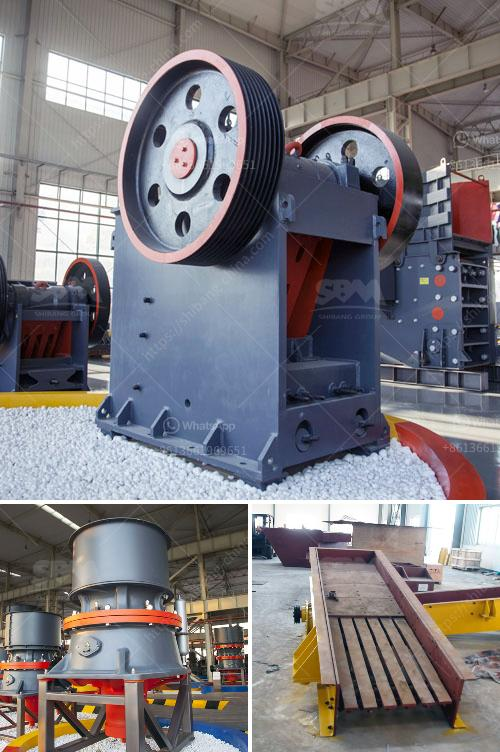

<h3>used crusher for sale in jamaica</h3>
Are you in the market for a high-quality, reliable, and affordable crusher in Jamaica? Look no further than the used crusher options available for sale in this beautiful Caribbean destination. Whether you are in the construction, mining, or quarrying industry, a used crusher can provide the crushing power and efficiency you need to get the job done.

There are several advantages to buying a used crusher in Jamaica. Firstly, it offers significant cost savings compared to purchasing a brand new crusher. When buying used, you can find machines in excellent condition that have been well-maintained by their previous owners. Additionally, a used crusher has already proven its capabilities and performance, giving you peace of mind that it can handle the tasks you require. With the right amount of research and inspection, you can find a used crusher that meets your specific needs and budget.

One of the most important factors to consider when buying a used crusher in Jamaica is the type of crusher that suits your requirements. There are various types of crushers available, including jaw crushers, cone crushers, impact crushers, and more. Each type has its own specific advantages and applications. For example, jaw crushers are ideal for primary crushing operations, while cone crushers are well-suited for secondary or tertiary crushing. Understanding your specific needs will help you choose the right type of crusher for your projects.

Another key consideration is the condition of the used crusher. Ensure that the seller provides detailed information about the machine's maintenance history, including any repairs or replacements of critical components. You should also ask for photographs or videos of the crusher in operation, if possible, to ensure its reliability. Taking the time to inspect the crusher thoroughly before purchasing can help you avoid any potential issues down the line.

In addition to considering the condition of the used crusher, it is also important to check if it comes with any additional equipment or attachments. Some sellers may offer crushers with additional features that enhance their versatility and productivity. For example, a crusher may come with a screening attachment, allowing you to process and separate materials on-site. Considering these additional features can add value to your purchase and make your operations more efficient.

When buying a used crusher in Jamaica, it is crucial to deal with reputable sellers or dealers. Look for sellers who have a strong reputation for honesty, reliability, and customer service. Asking for references or seeking recommendations from industry professionals is a great way to ensure you are working with a trustworthy seller.

In conclusion, a used crusher can be a cost-effective and efficient solution for your crushing needs in Jamaica. By considering factors such as the type of crusher, its condition, additional equipment or attachments, and dealing with reputable sellers, you can find a used crusher that meets your requirements and budget. So, start exploring the used crusher options available in Jamaica and make your crushing operations more productive and profitable.
<h3>Contact us</h3><ul><li><strong>Whatsapp:&nbsp;<a href="https://wa.me/8613661969651">+8613661969651</a></strong></li><li><a href="https://swt.shibang-china.com/?git&amp;zhl&amp;used crusher for sale in jamaica"><strong>Online Service(chat now)</strong></a></li></ul><h3>Related</h3><ul><li><a href='detail project report on quartz powder plant.md'>detail project report on quartz powder plant</a></li><li><a href='china clay grinding machine.md'>china clay grinding machine</a></li><li><a href='specifications of roller mill.md'>specifications of roller mill</a></li><li><a href='crushing and screening contractors in gauteng.md'>crushing and screening contractors in gauteng</a></li><li><a href='stone crushing machineries imphal.md'>stone crushing machineries imphal</a></li></ul>