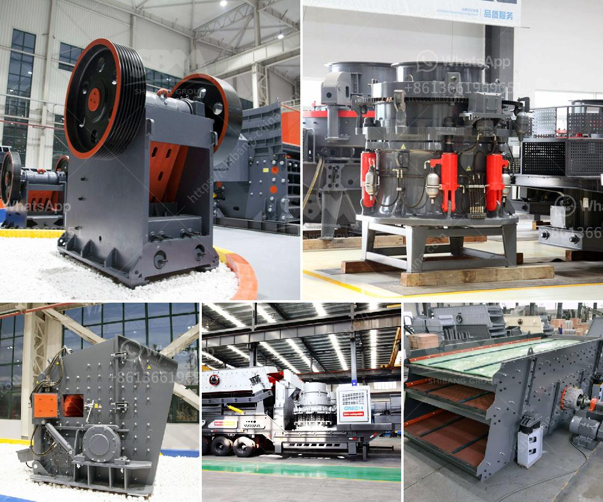

<h3>used crusher plant in dubai for sale</h3>
Dubai is the main trading center of the United Arab Emirates. In the past few years, Dubai has attracted many buyers from all over the world due to its rich mineral resources. Many customers want to buy crushing equipment, such as jaw crushers, impact crushers, cone crushers, etc., for the production of concrete aggregates. However, due to various factors, there is a limited supply of new crushers in Dubai. As a result, the market for used crusher plants in Dubai is steadily growing.

Used crusher plants are a viable option for many businesses because they are more affordable than new crushers. With fewer moving parts, they require less maintenance, enabling businesses to save money in the long run. Additionally, used crusher plants in Dubai are a great alternative for efficient crushing operations because they are flexible, reliable, and durable.

One of the used crusher plant models that is particularly popular in Dubai is the Metso Nordberg C160. This powerful jaw crusher is used in primary crushing situations, and it is easy to install and transport thanks to its compact size and advanced technology. As an efficient primary crushing device, the C160 provides excellent performance when used in upper crushing stages in aggregate production plants or mining operations.

When looking for a used crusher plant for sale in Dubai, there are a few important aspects to consider, including the durability and performance of the machine, its maintenance requirements, and its price. It is also crucial to inspect the crusher plant personally and check for any signs of wear or damage before making a purchase.

Overall, the market for used crusher plants in Dubai is expanding, and more and more businesses are investing in this cost-effective method of crushing materials. With a growing need for fine aggregates in construction, the demand for used crusher plants is increasing, stimulating the growth of the used crushers market in Dubai.
<h3>Contact us</h3><ul><li><strong>Whatsapp:&nbsp;<a href="https://wa.me/8613661969651">+8613661969651</a></strong></li><li><a href="https://swt.shibang-china.com/?git&amp;zhl&amp;used crusher plant in dubai for sale"><strong>Online Service(chat now)</strong></a></li></ul><h3>Related</h3><ul><li><a href='gyratory cone crusher.md'>gyratory cone crusher</a></li><li><a href='gold hammer mill for sale in south africa.md'>gold hammer mill for sale in south africa</a></li><li><a href='quarry crushers south africa.md'>quarry crushers south africa</a></li><li><a href='grinding machine 2 micron for calcium carbonate.md'>grinding machine 2 micron for calcium carbonate</a></li><li><a href='mobile crusher in sweden.md'>mobile crusher in sweden</a></li></ul>