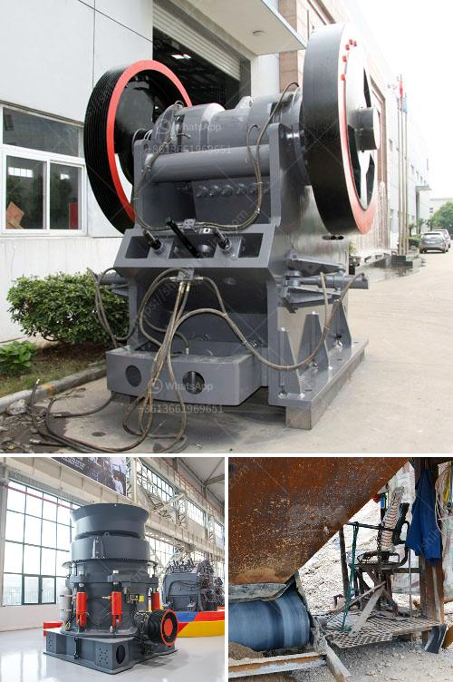

<h3>used crushers for sale nigeria</h3>
Nigeria, a country blessed with a plethora of natural resources, is recognizing the need to harness its resources through robust industrialization efforts. One crucial aspect of this industrialization involves the exploration and extraction of minerals and ores in various sectors such as construction, mining, and infrastructure development. Used crushers play a pivotal role in this process, aiding in breaking down larger chunks of rocks and minerals into smaller-sized materials suitable for further processing or use. Let us delve deeper into the world of used crushers for sale in Nigeria and explore their benefits and potential.

Cost-Effective Solution: Opting for used crushers proves to be an intelligent choice when it comes to cost savings. Investing in new crushers can be capital-intensive, especially for small-scale businesses or startups. Used crushers are a cost-effective alternative that offers similar operational efficiency at a fraction of the price. Additionally, the lower investment cost offers more room for diversification or expansion within the industry.

Improved Efficiency and Productivity: Used crushers ensure an optimized workflow by effectively breaking down large materials into smaller, more manageable sizes. This increased precision reduces the time required for subsequent processes and enhances overall productivity. A more streamlined workflow translates into better production output and profitability.

Eco-Friendly Solution: The mining and construction industry in Nigeria is progressively focusing on sustainable and environmentally friendly practices. Utilizing used crushers aligns with this agenda by repurposing existing machinery and preventing additional manufacturing waste. By reusing machinery, the industry makes a conscious effort towards lowering carbon emissions and reducing the strain on natural resources.

Availability of Well-Maintained Machinery: Pre-owned crushers for sale in Nigeria often come from reputable sellers who maintain and service these machines prior to resale. This ensures that the equipment is in good working condition, reducing the risk of unexpected breakdowns or maintenance issues. Moreover, reputable sellers often provide warranty options, refurbishment services, or technical support, ensuring a seamless transition and post-sales support.

Diverse Range of Crusher Types: Nigeria's industrial landscape demands diverse types of crushers to meet specific requirements. Used crushers for sale in Nigeria offer a wide array of options, including jaw crushers, cone crushers, impact crushers, and hammer crushers. Each type caters to different material hardness, throughput capacities, and end-product specifications. With such a variety, businesses can choose the crusher type that best suits their unique operational needs.

In conclusion, the acquisition of used crushers for sale in Nigeria showcases a valuable opportunity for businesses operating in the mining, construction, or infrastructure development sectors. These cost-effective solutions offer improved efficiency, reduced environmental impact, and a diverse range of options to cater to specific operational needs. By leveraging the benefits of used crushers, businesses can unlock the potential of Nigeria's rich resource deposits while maximizing profitability and contributing to sustainable growth.
<h3>Contact us</h3><ul><li><strong>Whatsapp:&nbsp;<a href="https://wa.me/8613661969651">+8613661969651</a></strong></li><li><a href="https://swt.shibang-china.com/?git&amp;zhl&amp;used crushers for sale nigeria"><strong>Online Service(chat now)</strong></a></li></ul><h3>Related</h3><ul><li><a href='mobile stone crusher plant south africa.md'>mobile stone crusher plant south africa</a></li><li><a href='mineral materials crusher.md'>mineral materials crusher</a></li><li><a href='generic mining safety induction powerpoint.md'>generic mining safety induction powerpoint</a></li><li><a href='copper concentrate plant manufacturers in south africa.md'>copper concentrate plant manufacturers in south africa</a></li><li><a href='jaw crusher for sale in kenya.md'>jaw crusher for sale in kenya</a></li></ul>