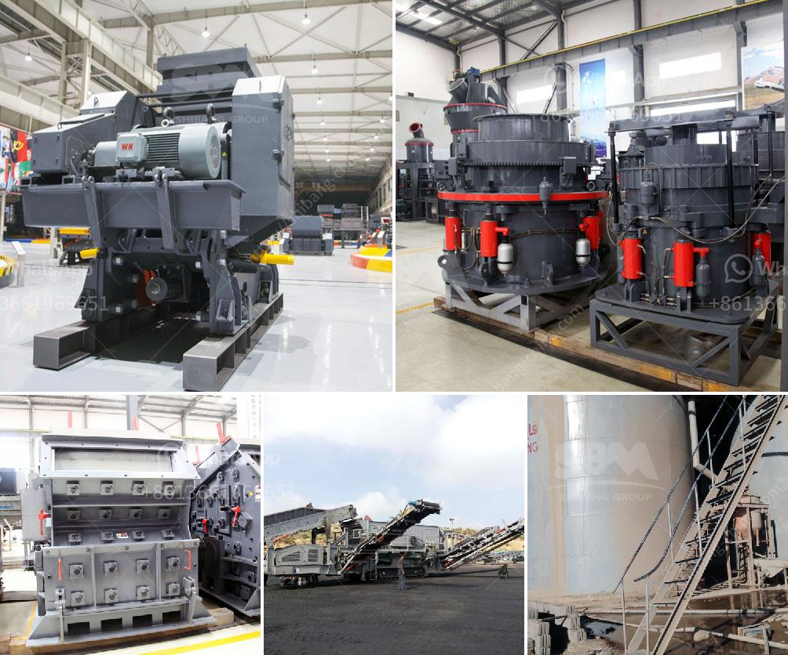

<h3>used for sale raymond roller mills india</h3>
Raymond roller mills are commonly known as milling machines or grinding mills. Anyone who has already invested in a mill will know that Raymond Roller Mill Parts are easy to come by. These machines are used to grind various insulation materials, glass, plaster, phosphate rock, cement, kaolin, bentonite, activated carbon, activated clay, lime, fluorite, dolomite, limestone, marble, talc, potash feldspar, calcite and gypsum. With a variety of Raymond mill models and technical advancements, more and more used for sale Raymond roller mills are available.

Raymond roller mills are often used for size reduction applications. The typical material sizes that are reduced by these mills include coal, ore, limestone and various chemicals. Raymond mills are also used for petroleum coke grinding. They can grind materials up to 80% - 400 mesh, and the granularity can be adjusted according to different requirements.

Since Raymond Roller Mills require less energy than other mills, they are often used in the cement industry. They are also used in the mining industry for reducing medium-hard to hard rock ores. A typical Raymond roller mill consists of a grinding chamber, air classifier, top of the mill, bottom of the mill, feeder bins, control panel and accessories. The airflow enters below the grinding chamber and carries pulverized material vertically, combining it with newly introduced feed, to the classifier where any acceptable material is then classified.

India is one of the largest markets for Raymond roller mills. These mills are extensively used in mineral, ore, chemical and metal powder industries. The capability of Raymond roller mill varies from 80-200tph. It is extensively used in the grinding process of various industrial materials such as calcite, marble, limestone, clay, slag, gypsum, salt, iron ore, glass, coal and other materials.

According to the market research, vertical roller mills can be used for grinding materials of all hardnesses. Raymond roller mills are available with grinding ring diameters ranging from 30-120 inches, depending on the material being ground. With the high-speed centrifugal grinder, the Raymond mill is widely used in powder-making and screening plants. The Raymond mill can grind more than 280 kinds of non-flammable and non-explosive materials with Mohs hardness lower than 9.3 and humidity lower than 6%, making them suitable for metallurgy, building materials, chemicals, mines and other industries.

With the growing demand for powdered materials, used for sale Raymond roller mills are an ideal choice for industrial grinding. Raymond mills can grind a variety of materials such as gypsum, talc, calcite, limestone, marble, glass, phosphate rock and other materials. That is suitable for grinding non-flammable and explosive minerals with Mohs hardness of less than 7 and humidity below 6%.

In conclusion, used for sale Raymond roller mills are highly efficient and reliable grinding mills, suitable for grinding a wide range of materials. Various models and technical advancements allow these mills to be used in various industries, including the mining and cement industries. If you are looking to purchase a used Raymond roller mill in India, then look no further. There are numerous options available to suit your needs and budget.
<h3>Contact us</h3><ul><li><strong>Whatsapp:&nbsp;<a href="https://wa.me/8613661969651">+8613661969651</a></strong></li><li><a href="https://swt.shibang-china.com/?git&amp;zhl&amp;used for sale raymond roller mills india"><strong>Online Service(chat now)</strong></a></li></ul><h3>Related</h3><ul><li><a href='grinding plant material gold.md'>grinding plant material gold</a></li><li><a href='black stone crushing thailand.md'>black stone crushing thailand</a></li><li><a href='mining and quarrying machinery and equipment.md'>mining and quarrying machinery and equipment</a></li><li><a href='calcium carbonate plant manufacturers.md'>calcium carbonate plant manufacturers</a></li><li><a href='portable hammer mill australia in perth.md'>portable hammer mill australia in perth</a></li></ul>