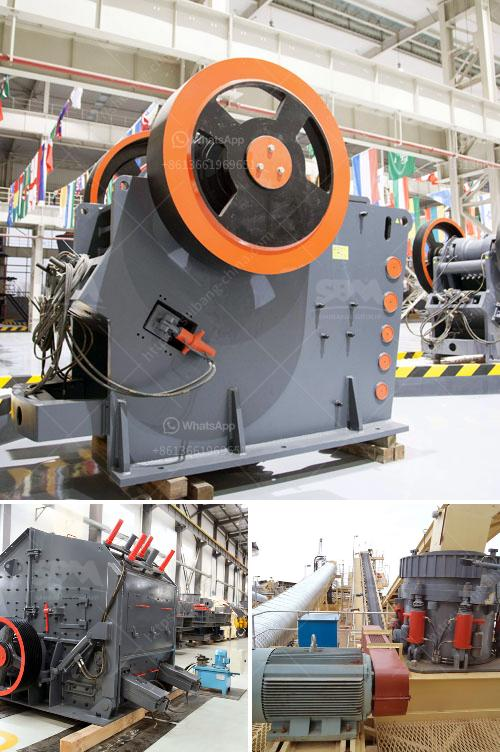

<h3>used gold mining equipment for sale in ghana</h3>
Ghana is one of the largest gold producers in Africa, attracting both local and foreign investors in the mining industry. There is a growing demand for gold mining machinery in the country, as many companies and individuals seek to extract gold from the rich mineral reserves found in Ghana. 

However, purchasing new gold mining equipment is often expensive and not feasible for small-scale miners or individuals with limited financial resources. This is where the market for used gold mining equipment comes in, offering affordable alternatives for those looking to venture into gold mining in Ghana.

Used gold mining equipment for sale in Ghana includes various types of mining equipment such as crushers, grinders, flotation units, dredges, wash plants, and conveyor systems. These machines are designed to extract gold from various types of deposits, ensuring a higher recovery rate and earning potential for miners.

The availability of used gold mining equipment in Ghana offers several advantages. Firstly, it allows individuals to start mining operations at a lower cost, minimizing the initial investment required. This is particularly beneficial for small-scale miners or those exploring mining opportunities for the first time.

Secondly, purchasing used equipment can save time as there is no need to wait for new machinery to be manufactured and delivered. This allows operators to commence gold mining activities immediately, reducing downtime and maximizing productivity.

Additionally, the used gold mining equipment market in Ghana offers a wide range of options, allowing buyers to choose the machinery that best suits their mining needs and preferences. From portable wash plants for small-scale mining to large dredges for industrial operations, there is a plethora of equipment available to meet specific requirements.

However, potential buyers should exercise caution when purchasing used gold mining equipment. It is essential to thoroughly inspect the equipment to ensure it is in good working condition with all necessary parts and components. Buyers should also consider the reputation and credibility of the seller before making a purchase.

In conclusion, the used gold mining equipment market in Ghana provides an affordable and accessible option for individuals and companies looking to embark on gold mining expeditions. With a wide range of available equipment, affordable prices, and the potential for high returns, this market segment presents lucrative opportunities for those interested in the gold mining industry.
<h3>Contact us</h3><ul><li><strong>Whatsapp:&nbsp;<a href="https://wa.me/8613661969651">+8613661969651</a></strong></li><li><a href="https://swt.shibang-china.com/?git&amp;zhl&amp;used gold mining equipment for sale in ghana"><strong>Online Service(chat now)</strong></a></li></ul><h3>Related</h3><ul><li><a href='processing of copper crusher in zambia.md'>processing of copper crusher in zambia</a></li><li><a href='mobile hammer crusher.md'>mobile hammer crusher</a></li><li><a href='bauxite mining machine.md'>bauxite mining machine</a></li><li><a href='used gold mining equipment for sale in ghana.md'>used gold mining equipment for sale in ghana</a></li><li><a href='top aggregate crusher suppliers in south africa.md'>top aggregate crusher suppliers in south africa</a></li></ul>