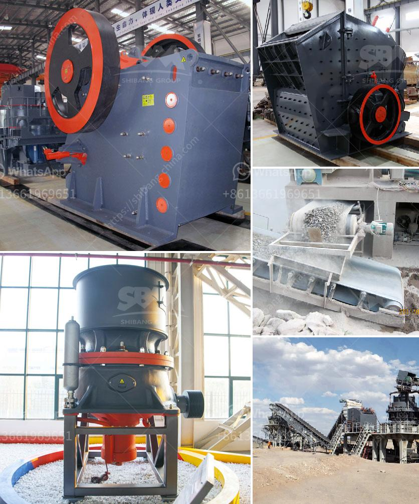

<h3>used gupsum board plant sale</h3>
The sale of used gypsum board plants has become increasingly popular in recent years, as businesses look for cost-effective ways to expand their operations or start new ventures in the construction industry. Gypsum board, commonly known as drywall, is a popular material for interior walls and ceilings due to its versatility, durability, and fire-resistant properties. Therefore, buying a used gypsum board plant can provide numerous benefits for companies seeking to enter or expand their presence in the construction realm.

One major advantage of purchasing a used gypsum board plant is the significant cost savings it offers compared to buying a brand-new plant. Building a new plant from scratch requires substantial investment in land, construction, machinery, and permits. On the other hand, purchasing a used plant can be a much more cost-efficient option, as it allows businesses to acquire a fully operational facility with all the necessary equipment at a fraction of the cost.

In addition to cost savings, buying a used gypsum board plant also reduces the time required to establish production. Constructing a new plant involves a lengthy process that includes land acquisition, design, construction, and installation of machinery. This timeline can be shortened considerably by purchasing a pre-existing plant, allowing businesses to start production and generate revenue much faster. This accelerated timeline can be especially advantageous for companies operating in competitive markets where time is of the essence.

Another benefit of buying a used gypsum board plant is the opportunity to make improvements and upgrades according to specific business needs. Depending on the condition of the purchased plant, it may require some refurbishment or modernization. However, these modifications can be tailored in line with the company's unique requirements, ensuring that the plant is optimized for maximum efficiency and productivity. This flexibility allows businesses to customize the plant according to their specific production needs, potentially leading to improved output and cost savings in the long run.

Moreover, the purchase of a used gypsum board plant can also provide access to valuable expertise and knowledge. Many sellers offer technical support, training, and assistance during the transition period, helping companies navigate the complexities of machinery operation and maintenance. This knowledge transfer can be invaluable, particularly for businesses that are new to the gypsum board manufacturing industry or wish to expand their existing operations.

However, before purchasing a used gypsum board plant, it is essential to conduct thorough due diligence. Businesses should carefully assess the equipment's condition, evaluate its performance history, and verify its compliance with safety and environmental regulations. Hiring an expert or a specialized engineer to inspect the plant can help identify any potential risks or issues that might require attention and additional investment.

In conclusion, the sale of used gypsum board plants presents an attractive opportunity for businesses looking to enter or expand in the construction industry. The cost savings, accelerated timeline, customization potential, and access to expertise make buying a used plant a wise choice for many companies. However, thorough due diligence is crucial to ensure the plant's condition and compliance with regulations. By carefully assessing the options available, businesses can make an informed decision that best suits their needs, giving them a competitive advantage in the growing gypsum board market.
<h3>Contact us</h3><ul><li><strong>Whatsapp:&nbsp;<a href="https://wa.me/8613661969651">+8613661969651</a></strong></li><li><a href="https://swt.shibang-china.com/?git&amp;zhl&amp;used gupsum board plant sale"><strong>Online Service(chat now)</strong></a></li></ul><h3>Related</h3><ul><li><a href='cost sand dryer in keralan.md'>cost sand dryer in keralan</a></li><li><a href='cement plant tons per day.md'>cement plant tons per day</a></li><li><a href='japan directory of mobile crushing plant.md'>japan directory of mobile crushing plant</a></li><li><a href='clay grinder mill machine.md'>clay grinder mill machine</a></li><li><a href='quarry business for sale in nigeria.md'>quarry business for sale in nigeria</a></li></ul>