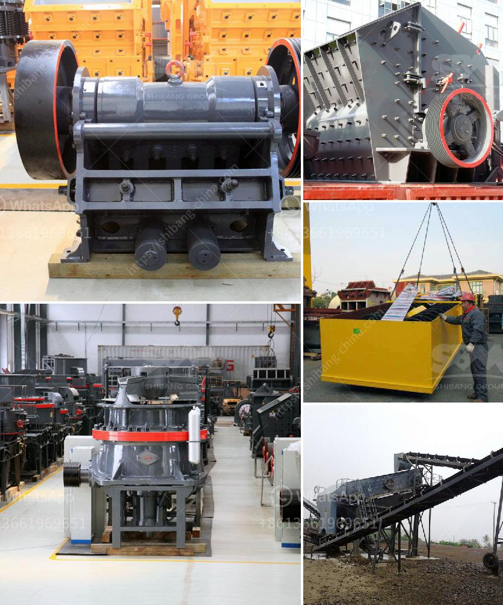

<h3>used gypsum plant for sale europe</h3>
Are you in the market for a used gypsum plant in Europe? Look no further! There are numerous options available for sale, providing an excellent opportunity for businesses looking to expand their operations or enter the gypsum manufacturing industry.

Gypsum is a versatile material used in a variety of industries, including construction, agriculture, and even healthcare. With its fire-resistant properties, gypsum is a popular choice for interior walls, ceilings, and insulation.

Purchasing a used gypsum plant can be a cost-effective solution for businesses with a limited budget. These plants come with the benefit of being fully operational, often including all the necessary equipment and machinery. When compared to building a new plant from scratch, buying a used one can save both time and money.

In Europe, there are several companies that specialize in selling used industrial plants, including gypsum plants. These companies carefully dismantle plants that are no longer in use and make them available for sale. They ensure that all the equipment is in good working condition, providing buyers with a reliable and efficient solution.

When considering a used gypsum plant, it's essential to assess its condition, capacity, and any necessary upgrades. Consulting with experts in the field, such as engineers or industry consultants, can help guide you in making an informed decision.

Moreover, buying a used gypsum plant in Europe opens up opportunities for businesses to tap into the continent's thriving construction industry. For instance, countries like Germany, France, and the United Kingdom have a strong demand for gypsum-based products due to their active construction sectors.

In conclusion, a used gypsum plant for sale in Europe is an excellent investment for businesses in need of a cost-effective solution for their manufacturing needs. With the various options available, it's crucial to conduct thorough research, assess the plant's condition, and consult with industry experts to ensure a sound investment. Don't miss out on this opportunity to expand your operations and tap into the growing European market.
<h3>Contact us</h3><ul><li><strong>Whatsapp:&nbsp;<a href="https://wa.me/8613661969651">+8613661969651</a></strong></li><li><a href="https://swt.shibang-china.com/?git&amp;zhl&amp;used gypsum plant for sale europe"><strong>Online Service(chat now)</strong></a></li></ul><h3>Related</h3><ul><li><a href='used gold mining equipment for sale in ghana.md'>used gold mining equipment for sale in ghana</a></li><li><a href='high purity quartz crusher processing.md'>high purity quartz crusher processing</a></li><li><a href='capacity of the jaw crusher.md'>capacity of the jaw crusher</a></li><li><a href='ultrafine mill crusher price in india.md'>ultrafine mill crusher price in india</a></li><li><a href='3 4 inch crushed limestone.md'>3 4 inch crushed limestone</a></li></ul>