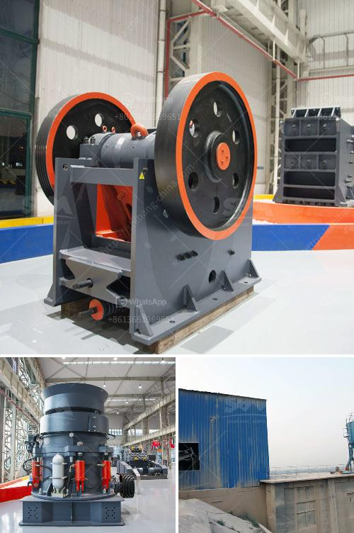

<h3>used heavy duty jaw crushing machine</h3>
The crushing and screening industry plays a crucial role in various sectors, including mining, construction, and recycling. One of the most commonly used machines in this industry is the heavy-duty jaw crusher. As demand for these machines continues to rise, many businesses opt for buying used heavy-duty jaw crushing machines due to their cost-effectiveness and durability. In this article, we will explore how these machines are reshaping the industry with their versatility and efficiency.

Used heavy-duty jaw crushing machines boast exceptional versatility when it comes to crushing a wide range of materials. From hard and abrasive granite to soft limestone, these machines can handle various types of rocks with ease. Their adjustable settings allow the user to choose the desired output size, resulting in reliable and consistent final products. Furthermore, since different industries require different specifications, these machines offer customizable features, enabling operators to adapt to specific production requirements.

In addition to their versatility, used heavy-duty jaw crushing machines deliver remarkable efficiency. With their powerful motors and high reduction ratios, these machines can process large volumes of material quickly and effectively. Their robust construction ensures minimal downtime, allowing for continuous production and enhanced productivity. Moreover, the finely tuned mechanics and optimized jaw design enable these machines to consume less energy per unit of crushed material, contributing to environmental sustainability.

One of the primary reasons businesses opt for used heavy-duty jaw crushing machines is their exceptional durability. These machines are built to withstand the most demanding operating conditions, making them ideal for heavy-duty applications. With their sturdy frames and thick cast steel plates, they can handle the toughest materials without compromising performance. Moreover, their wear-resistant parts can be easily replaced, ensuring prolonged operational life and reduced maintenance costs.

Investing in used heavy-duty jaw crushing machines offers significant cost advantages for businesses. Buying used equipment allows for substantial savings compared to purchasing brand new machines. Furthermore, as technology rapidly advances, many used machines are still capable of providing the necessary performance and reliability at a fraction of the cost. Additionally, these machines have proven track records, and their reliability has been tested by previous owners, giving buyers peace of mind.

Used heavy-duty jaw crushing machines continue to revolutionize the crushing and screening industry with their versatility, efficiency, and cost-effectiveness. Whether it's for mining, construction, or recycling, these machines can handle a wide range of materials and produce consistent and high-quality final products. With their robust construction, they can withstand extreme conditions, minimizing downtime and ensuring continuous production. By opting for used equipment, businesses can benefit from substantial cost savings without compromising performance. As the demand for crushing machines continues to grow, used heavy-duty jaw crushing machines present a lucrative solution for operators seeking reliable and efficient equipment.
<h3>Contact us</h3><ul><li><strong>Whatsapp:&nbsp;<a href="https://wa.me/8613661969651">+8613661969651</a></strong></li><li><a href="https://swt.shibang-china.com/?git&amp;zhl&amp;used heavy duty jaw crushing machine"><strong>Online Service(chat now)</strong></a></li></ul><h3>Related</h3><ul><li><a href='italy stone crusher manufacter.md'>italy stone crusher manufacter</a></li><li><a href='limestone ball mill.md'>limestone ball mill</a></li><li><a href='concrete crushing machine in india.md'>concrete crushing machine in india</a></li><li><a href='types of grinding mills.md'>types of grinding mills</a></li><li><a href='vibration ranges for jaw crusher.md'>vibration ranges for jaw crusher</a></li></ul>