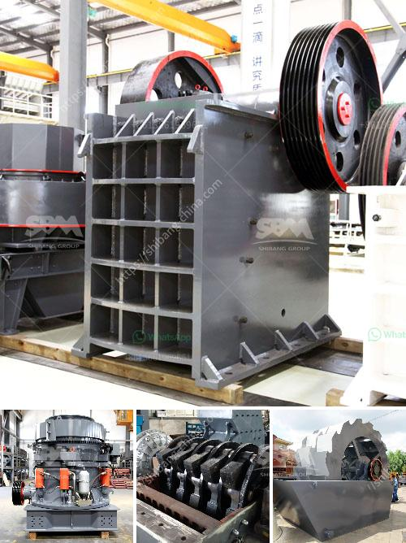

<h3>used limestone crusher provider in nigeria</h3>
In Nigeria, limestone mining equipment is commonly used for crushing limestone materials into small pieces with the capacity of 100-300tph. Used limestone crusher provider in Nigeria is crucial for the renewable and sustainable development of Nigeria's economy. Nigeria is rich in natural resources, including limestone, petroleum, natural gas, tin, iron ore, coal, limestone, niobium, lead, and zinc, granite and many other types of stones and rocks.

Limestone mining plays an important role in Nigeria's economy as limestone deposits are abundant. It is used extensively in building materials, cement production, highway construction, and architectural decoration. With the increasing demand for limestone products, the use of limestone crusher machines has become more common in Nigeria.

Limestone crushers are used to break limestone rocks into smaller sizes. The size of the crusher machines determines the capacity of the crusher. The smaller the size, the higher the capacity. Normally, jaw crushers are used for primary crushing, while the impact or cone crushers are used for secondary or tertiary crushing.

Used limestone crusher provider in Nigeria is usually used for coarse and medium crushing operations. It is a new type of crushing machine designed for quarrying and recycling applications. The open-side discharge settings range from 40mm to 125mm, allowing for a higher degree of flexibility. With a throughput capacity of up to 200tph, the used limestone crusher provider in Nigeria is suitable for crushing a variety of materials, including limestone, granite, basalt, shale, river stone, bluestone, sandstone, calcium carbide, iron ore, copper ore, steel slag, etc.

In addition to crushing limestone, this crusher can also be used for crushing other materials such as gypsum, coal, marble, and brick. It has the advantages of uniform particle size, accurate grading, high efficiency, low energy consumption, low operating cost, and convenient maintenance.

When choosing a used limestone crusher provider in Nigeria, it is important to consider a few factors. First, the performance and quality of the crusher should be reliable. This can be determined by checking the manufacturer's reputation and customer reviews. Second, the price of the crusher should be reasonable and within your budget. Lastly, the after-sales service should be efficient and timely, ensuring that any issues or concerns are addressed promptly.

To conclude, the used limestone crusher provider in Nigeria is crucial for the development of Nigeria's economy. It is used extensively in various industries, providing materials for construction, infrastructure, and manufacturing. Therefore, investing in a high-quality and reliable limestone crusher is essential for businesses in Nigeria.
<h3>Contact us</h3><ul><li><strong>Whatsapp:&nbsp;<a href="https://wa.me/8613661969651">+8613661969651</a></strong></li><li><a href="https://swt.shibang-china.com/?git&amp;zhl&amp;used limestone crusher provider in nigeria"><strong>Online Service(chat now)</strong></a></li></ul><h3>Related</h3><ul><li><a href='clay powder machine.md'>clay powder machine</a></li><li><a href='impact crusher manufacturers china.md'>impact crusher manufacturers china</a></li><li><a href='bimach grinding marble.md'>bimach grinding marble</a></li><li><a href='crushing plant process flow.md'>crushing plant process flow</a></li><li><a href='used stone crusher in nairobi.md'>used stone crusher in nairobi</a></li></ul>