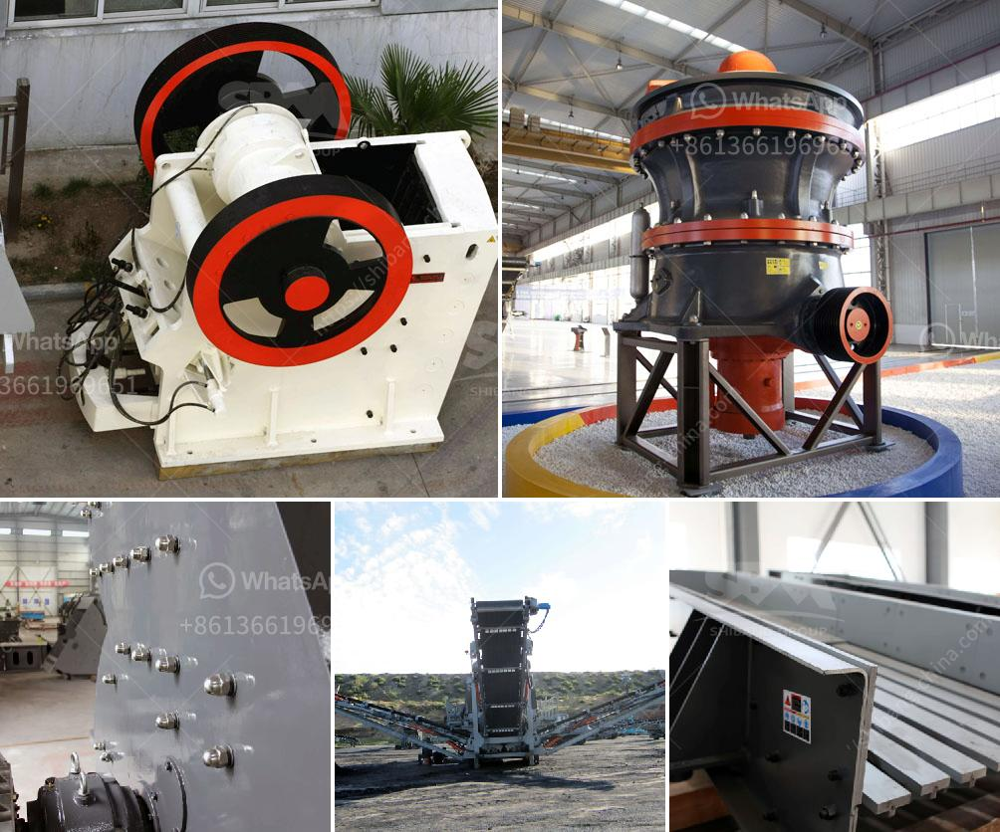

<h3>used mini grinding plant india sale</h3>
Mini grinding plants are compact and small-scale equipment used for grinding different types of materials. These plants are particularly popular in India due to their efficiency and cost-effectiveness. Used mini grinding plants are readily available in the market and offer a great option for businesses or individuals looking for affordable grinding solutions.

One of the significant advantages of a used mini grinding plant is its smaller size, which makes it suitable for small-scale operations and limited workspace. These plants can be easily installed in factories or workshops where space is a constraint. Despite their compact size, used mini grinding plants are designed to deliver efficient performance and provide excellent grinding results.

India has a diverse industrial sector with various manufacturing units that require grinding plant for material processing. Used mini grinding plants can be a cost-effective solution for these industries as they offer the same functionality as new ones but at a lower price. Many businesses prefer to invest in used grinding plants to save money, especially when they are starting or expanding their operations.

Moreover, buying a used mini grinding plant provides an opportunity to get equipment from well-known manufacturers at a discounted price. Reputed manufacturers in India offer reliable and high-quality grinding plants that are built to last. By purchasing a used plant from these manufacturers, businesses can avail the benefits of a reputable brand at a relatively lower cost.

When buying a used mini grinding plant, it is essential to consider the condition of the equipment. Inspecting the plant thoroughly and checking its performance before making a purchase is crucial. Evaluating the maintenance history and the overall wear and tear of the machine will help determine its reliability.

In conclusion, used mini grinding plants offer a viable option for businesses and individuals in India who require efficient and cost-effective grinding solutions. These compact plants are easy to install, provide excellent performance, and can be obtained from reputed manufacturers at a lower price. However, it is important to inspect the used equipment thoroughly to ensure its quality and reliability.
<h3>Contact us</h3><ul><li><strong>Whatsapp:&nbsp;<a href="https://wa.me/8613661969651">+8613661969651</a></strong></li><li><a href="https://swt.shibang-china.com/?git&amp;zhl&amp;used mini grinding plant india sale"><strong>Online Service(chat now)</strong></a></li></ul><h3>Related</h3><ul><li><a href='iron ore to iron process made in canada.md'>iron ore to iron process made in canada</a></li><li><a href='screening plant philippines.md'>screening plant philippines</a></li><li><a href='costruire une machine pour broyer des briques.md'>costruire une machine pour broyer des briques</a></li><li><a href='equipment to start up a quarry crusher.md'>equipment to start up a quarry crusher</a></li><li><a href='gold mining wash plants for sale in ghana.md'>gold mining wash plants for sale in ghana</a></li></ul>