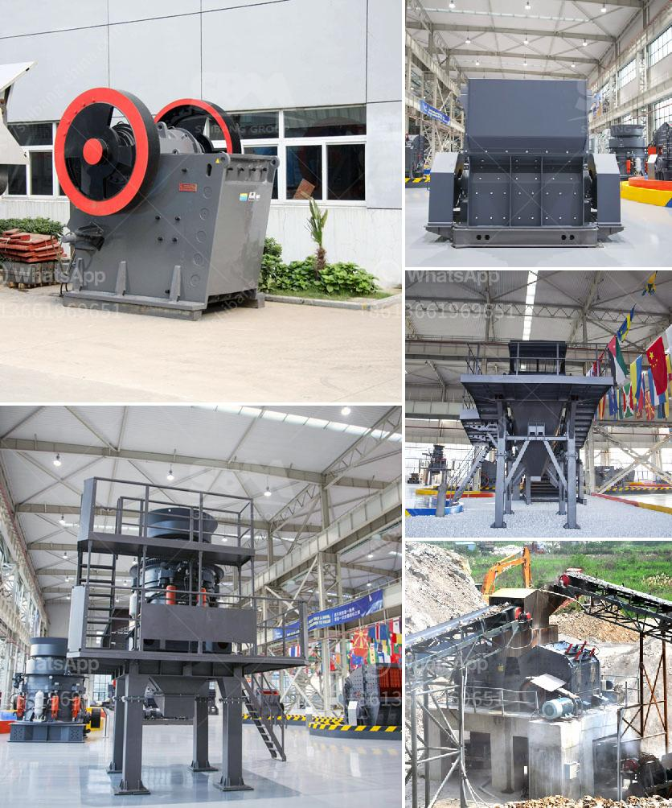

<h3>used mobile crusher in uae</h3>
The UAE has been attracting various businesses and industries around the world due to its booming economy. As a result, there has been an increase in the demand for machinery like crushers and several other construction equipment in the region.

UAE is a fast-developing country with modern infrastructure. The market for used mobile crushers has become more important due to the growth of the construction industry. With the increasing number of construction projects in the country, the demand for crushers and other mining equipment is also steadily rising.

Used crushers are a valuable resource for mining companies. They offer a cost-effective solution for crushing large rocks into smaller ones for further processing. Crushers are typically used to break down ore into smaller pieces and extract valuable minerals. With the increasing demand for minerals, the need for crushers is also on the rise.

One of the key factors contributing to the growth of the used mobile crusher market is the ease of availability of these machines. In the UAE, many businesses that are involved in the mining and construction industries use crushers to break down large rocks into smaller pieces. These businesses often replace their crushers with newer models, resulting in a surplus of used crushers available in the market.

Another reason why the market for used crushers is booming in the UAE is the cost-effectiveness of these machines. Compared to buying a new crusher, purchasing a used one can be a more economical option. This is especially true for small and medium-sized businesses that have a limited budget for purchasing heavy machinery. By investing in a used crusher, businesses can save a significant amount of money, allowing them to allocate their resources elsewhere.

Furthermore, the used mobile crusher market in the UAE offers a wide range of options to choose from. Some crushers are designed for specific types of minerals, while others can handle different types of rocks and ores. This diversity allows businesses to find a crusher that suits their specific needs without having to compromise on the quality of the machine.

However, it is important for buyers to be cautious when purchasing used mobile crushers in the UAE. They should thoroughly inspect the machine to ensure that it is in good working condition. Additionally, it is advisable to consult with industry experts or hire professionals who can assess the condition of the crusher before making a purchase.

In conclusion, the demand for used mobile crushers in the UAE is steadily increasing due to the growth of the construction and mining industries. These crushers offer a cost-effective solution for businesses looking to crush rocks and extract valuable minerals. The availability, cost-effectiveness, and wide range of options make used mobile crushers an attractive choice for many businesses in the UAE. However, it is important for buyers to exercise caution and thoroughly inspect the machines before making a purchase.
<h3>Contact us</h3><ul><li><strong>Whatsapp:&nbsp;<a href="https://wa.me/8613661969651">+8613661969651</a></strong></li><li><a href="https://swt.shibang-china.com/?git&amp;zhl&amp;used mobile crusher in uae"><strong>Online Service(chat now)</strong></a></li></ul><h3>Related</h3><ul><li><a href='small gold rock crushers with chain.md'>small gold rock crushers with chain</a></li><li><a href='gold plant for sale philippines.md'>gold plant for sale philippines</a></li><li><a href='counting sensors for conveyor belts.md'>counting sensors for conveyor belts</a></li><li><a href='nigeira mobile crushing plant.md'>nigeira mobile crushing plant</a></li><li><a href='silica processing company.md'>silica processing company</a></li></ul>