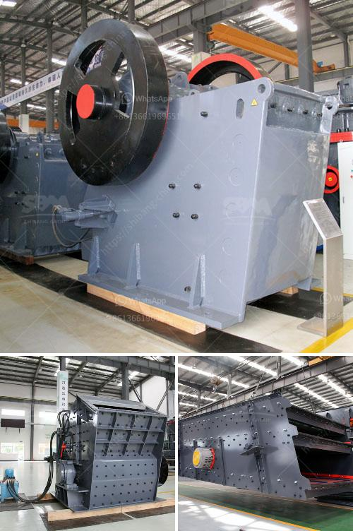

<h3>used mobile hammer mills for sale</h3>
When it comes to processing materials such as wood, agricultural residues, and other biomass products, having the right equipment is crucial. One popular piece of machinery for these applications is a mobile hammer mill. This versatile tool allows for the efficient reduction of materials into smaller, more manageable sizes. If you are in the market for a used mobile hammer mill, there are several factors to consider.

Firstly, mobile hammer mills offer a significant advantage over traditional stationary hammer mills: mobility. With a mobile unit, you can easily bring the mill to the material source, reducing transportation costs and saving time. This is especially beneficial for operations located in remote areas or for companies that work on many different sites.

Another benefit of mobile hammer mills is their versatility. They can process a wide range of materials, including wood chips, sawdust, straw, stalks, and various types of agricultural residues. This makes them ideal for applications in the biomass and animal feed industries. The ability to produce consistent particle sizes is crucial for optimizing the performance of these processes, and a mobile hammer mill can help achieve that.

One key factor to consider when buying a used mobile hammer mill is its condition. Used machinery can be a cost-effective alternative to buying new, but it's important to ensure that the equipment is in good working order. Look for a reputable seller or dealer who can provide you with detailed information about the mill's history, maintenance, and any repairs that have been done. Inspecting the machine in person and running tests before making a purchase is also advisable.

Additionally, it's important to consider the power source of the mobile hammer mill. Some units are powered by diesel engines, while others may run on electricity. The choice between the two depends on factors such as your location, available infrastructure, and operational requirements. Diesel-powered mills offer the advantage of portability, as they don't rely on a fixed power source. On the other hand, electric mills may be more suitable for operations with access to reliable electricity.

Price is another important consideration. Used mobile hammer mills can vary in price depending on factors such as their age, condition, and features. It's always a good idea to compare prices from different sellers and weigh them against the mill's specifications and overall condition. This will help ensure that you're getting the best value for your money.

Finally, it's crucial to consider the after-sales support offered by the seller or manufacturer. A reputable seller should provide technical support, spare parts, and repair services to ensure the longevity of the mill and minimize downtime.

To summarize, used mobile hammer mills can be an excellent investment for businesses involved in biomass processing and animal feed production. The ability to bring the mill to the material source, versatility in processing different materials, and cost savings compared to buying new are all compelling reasons to consider a used mobile hammer mill. However, it's crucial to thoroughly inspect the equipment's condition, consider the power source options, compare prices, and factor in after-sales support when making your purchase.
<h3>Contact us</h3><ul><li><strong>Whatsapp:&nbsp;<a href="https://wa.me/8613661969651">+8613661969651</a></strong></li><li><a href="https://swt.shibang-china.com/?git&amp;zhl&amp;used mobile hammer mills for sale"><strong>Online Service(chat now)</strong></a></li></ul><h3>Related</h3><ul><li><a href='small scale quarry stone making machine.md'>small scale quarry stone making machine</a></li><li><a href='xzm series ultra fine mill zenith.md'>xzm series ultra fine mill zenith</a></li><li><a href='impact crusher hammer mill.md'>impact crusher hammer mill</a></li><li><a href='sale pe series jaw crusher.md'>sale pe series jaw crusher</a></li><li><a href='price of grinder machine in india.md'>price of grinder machine in india</a></li></ul>