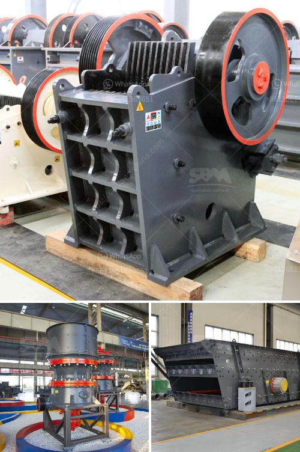

<h3>used mobile jaw crusher dealers in ghana</h3>
In Ghana, mining operations are an integral part of the country's socio-economic development. However, the activities of these mining companies have severe environmental consequences for the surrounding communities. This has led to increased regulations and stricter environmental laws, forcing construction companies to adopt more sustainable and cost-effective practices.

One such practice is the use of used mobile jaw crushers. These crushers, also known as mobile rock crushers, are a popular machinery choice for many construction and mining companies in Ghana. The ability to quickly and effectively crush different types of materials has made them indispensable in the mining and construction industry.

Used mobile jaw crushers are designed specifically for the needs of processing hard rock. They are typically used in quarrying, mining, recycling, and construction demolition sites. This versatile machine can process a wide range of materials, including construction waste, concrete, bricks, asphalt, and natural stone.

One of the main advantages of using a used mobile jaw crusher is its efficiency. These machines have a high output capacity, making them ideal for large-scale construction projects. Additionally, they can process materials quickly and efficiently, reducing the need for manual labor and increasing productivity on-site.

Another significant benefit of purchasing a used mobile jaw crusher is cost savings. Compared to new models, used crushers are generally more affordable, making them an attractive investment for construction companies in Ghana. Additionally, the cost of maintenance and repairs for used machinery tends to be lower, leading to further cost savings over time.

Finding reputable used mobile jaw crusher dealers in Ghana is crucial to ensure the quality and reliability of the equipment. Local dealers who specialize in used machinery can provide construction companies with the necessary information and guidance to make an informed purchase decision. They can offer advice on the type of crusher that best fits the project requirements, as well as provide maintenance and after-sales support.

When selecting a used mobile jaw crusher dealer, it is essential to consider their reputation, experience, and customer reviews. Buying from a reputable dealer helps ensure that the equipment has been properly inspected, serviced, and maintained before being sold. This reduces the risk of unexpected breakdowns or costly repairs.

In Ghana, several well-established dealers specialize in used mobile jaw crushers. They understand the unique needs and requirements of the construction industry and can provide comprehensive solutions tailored to individual projects. These dealers often have a wide range of models and brands available, allowing construction companies to choose the most suitable crusher for their specific needs.

In conclusion, using a used mobile jaw crusher is a cost-effective solution for construction companies in Ghana. These crushers offer numerous advantages, including high efficiency, versatility, and cost savings. However, finding reputable dealers is crucial to ensure the quality and reliability of the equipment. By investing in a used mobile jaw crusher from a reputable dealer, construction companies can enhance their productivity, reduce costs, and contribute to a more sustainable future.
<h3>Contact us</h3><ul><li><strong>Whatsapp:&nbsp;<a href="https://wa.me/8613661969651">+8613661969651</a></strong></li><li><a href="https://swt.shibang-china.com/?git&amp;zhl&amp;used mobile jaw crusher dealers in ghana"><strong>Online Service(chat now)</strong></a></li></ul><h3>Related</h3><ul><li><a href='price list for belt conveyor pdf.md'>price list for belt conveyor pdf</a></li><li><a href='coal washing plant design.md'>coal washing plant design</a></li><li><a href='gold plant for sale philippines.md'>gold plant for sale philippines</a></li><li><a href='crusher jaw crusher 16x8.md'>crusher jaw crusher 16x8</a></li><li><a href='process of gypsum board manufacturing.md'>process of gypsum board manufacturing</a></li></ul>