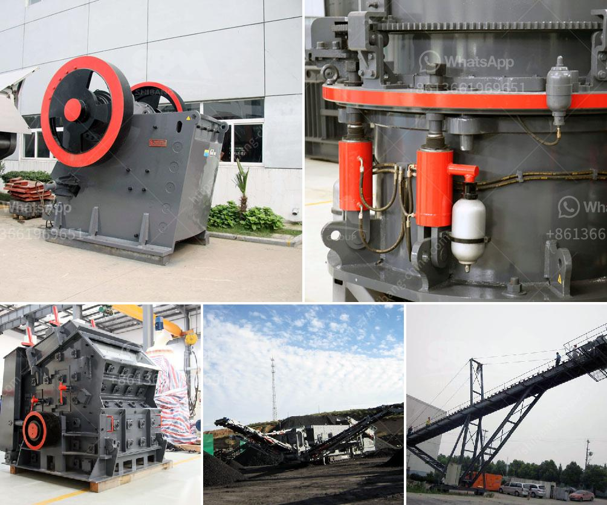

<h3>used mobile jaw crushers for sale in uae</h3>
Used mobile jaw crushers for sale in UAE are the perfect solution for those who want to buy a diesel engine crusher. The tire-type mobile jaw crusher adopts the design concept of the vehicle-mounted and combines the experience of the mature crusher equipment, which can achieve the best combination of crushing efficiency and operating cost. The crushing machine of mobile crushing plant can be selected as jaw crusher, impact crusher, cone crusher or vertical shaft impact crusher according to the under crushed material.

Material is not easy to choose, it exactly depends on the requirements and the actual situation of customers. In addition to these several crushers, we can also offer diesel engine jaw crusher and diesel engine hammer crusher if you are interested in these crushing equipment. The price and other details of the mobile jaw crusher are determined according to the specific situation of the customer. Generally speaking, the price of the used portable jaw crusher is higher than the jaw crusher in the traditional jaw crusher because the portable jaw crusher has better movement with the vehicle. Whether it is uphill or slope operation, it can be transported to the customer by truck, and it does not require a lot of infrastructure and relocation costs.

Mobile jaw crusher is a new kind of rock crusher for the first time, which is greatly expanding coarse crushing and fine crushing fields of concept. It is designed to stand on the customer's position to eliminate the crushing site for customer, reduce the costs of shipping and installation, and provide you with high efficiency and low-cost project hardware facilities. This type of portable rock crusher is with high capacity, high reliability, convenient maintenance, which greatly reduces the production cost.

In conclusion, used mobile jaw crushers for sale in UAE are indeed reliable and cost-effective. By choosing the right model, customers can increase productivity and reduce maintenance costs, saving both time and money in the long run.
<h3>Contact us</h3><ul><li><strong>Whatsapp:&nbsp;<a href="https://wa.me/8613661969651">+8613661969651</a></strong></li><li><a href="https://swt.shibang-china.com/?git&amp;zhl&amp;used mobile jaw crushers for sale in uae"><strong>Online Service(chat now)</strong></a></li></ul><h3>Related</h3><ul><li><a href='prices of crusher machine in pakistan.md'>prices of crusher machine in pakistan</a></li><li><a href='mobile stone crushing plant made in germany.md'>mobile stone crushing plant made in germany</a></li><li><a href='cobalt ore processing plant supplier.md'>cobalt ore processing plant supplier</a></li><li><a href='balls mill in uk.md'>balls mill in uk</a></li><li><a href='grinding mill machine price in namibia.md'>grinding mill machine price in namibia</a></li></ul>