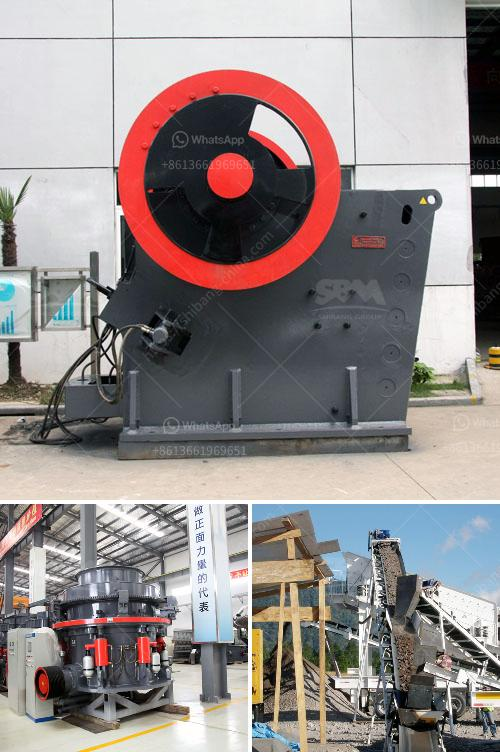

<h3>used nd hand coal crusher sizer</h3>
Coal crusher is one of the most commonly used crushing equipment in coal mining and processing industries. As the crusher machines are heavy machinery, it is crucial to make sure the machines are durable and reliable in order to guarantee optimal efficiency and productivity in coal crushing process and plant operations. 

However, purchasing new crushers can be a costly investment for many businesses. This is where used nd hand coal crusher sizers can come in handy. A coal crusher sizer is specifically designed to break down oversize coal lumps into more manageable sizes for conveying and further processing. Used nd hand coal crusher sizers can be utilized in multiple stages of coal crushing and screening.

Used nd hand coal crusher sizers can be a great alternative to brand new machines and provide the same results at a lower cost. They are most commonly used for secondary or tertiary crushing of coal and can be customized for specific needs. These machines offer a wide range of capacities, from small to large, making them suitable for a variety of coal applications.

When purchasing used nd hand coal crusher sizers, it is important to consider the condition of the machine, its maintenance history, and the reputation of the seller. It is recommended to consult with experts or professionals who specialize in coal processing equipment before making a purchase. They can help assess the suitability and quality of the used machine.

Additionally, regular maintenance and inspections should be performed on the used nd hand coal crusher sizers to ensure their optimal performance and longevity. This includes checking for any signs of wear and tear, ensuring proper lubrication, and replacing damaged or worn-out parts when necessary.

In conclusion, used nd hand coal crusher sizers can be a cost-effective solution for businesses in need of reliable coal crushing equipment. They offer the same performance as new machines but at a lower cost. However, it is crucial to consider the condition and maintenance history of the used machine before making a purchase. With proper maintenance and regular inspections, used nd hand coal crusher sizers can provide efficient and reliable coal crushing solutions for various applications.
<h3>Contact us</h3><ul><li><strong>Whatsapp:&nbsp;<a href="https://wa.me/8613661969651">+8613661969651</a></strong></li><li><a href="https://swt.shibang-china.com/?git&amp;zhl&amp;used nd hand coal crusher sizer"><strong>Online Service(chat now)</strong></a></li></ul><h3>Related</h3><ul><li><a href='ball mill catalogue.md'>ball mill catalogue</a></li><li><a href='river pebble crusher manufacturer.md'>river pebble crusher manufacturer</a></li><li><a href='roller mill in india.md'>roller mill in india</a></li><li><a href='quartz powder suppliers in dubai.md'>quartz powder suppliers in dubai</a></li><li><a href='large size stone crusher price.md'>large size stone crusher price</a></li></ul>