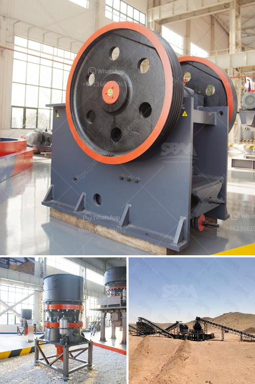

<h3>used portable gravel screens for sale</h3>
Are you in the market for a portable gravel screen? Look no further, as we have a wide range of used portable gravel screens for sale that might just fit your needs. Whether you are a small-scale contractor or a homeowner looking to do some landscaping, these screens can be a game-changer in streamlining your gravel separation process.

One of the primary advantages of opting for used portable gravel screens is the significant cost savings. These screens come at a fraction of the price of brand new ones, allowing you to allocate your budget to other essential equipment or projects. Despite being used, these screens are often in excellent condition and can perform with the same efficiency and effectiveness as new ones.

Durability is another crucial aspect when it comes to gravel screens. Luckily, many of the used portable gravel screens we offer have been built to withstand rigorous conditions. They are designed to handle heavy loads and are made from high-quality materials that resist wear and tear. This durability ensures that your investment will last for years to come, providing you with a reliable and efficient screening solution.

Portability is another advantage of these used gravel screens. Being portable means that you can easily transport them from one location to another, enabling you to take on various projects with ease. Whether you are moving from one construction site to another or need to screen gravel in multiple areas of your property, these screens can be transported and set up quickly.

When purchasing a used portable gravel screen, it is essential to consider the specifications that meet your individual requirements. With a wide range of options available, you can select a screen size, capacity, and power source that aligns perfectly with your needs.

In conclusion, if you are in the market for a portable gravel screen, consider exploring our selection of used options. These screens offer significant cost savings, exceptional durability, and the convenience of portability. With a range of choices available, finding the right screen to streamline your gravel separation process has never been easier. Don't miss out on the opportunity to enhance your productivity and efficiency – check out our used portable gravel screens for sale today!
<h3>Contact us</h3><ul><li><strong>Whatsapp:&nbsp;<a href="https://wa.me/8613661969651">+8613661969651</a></strong></li><li><a href="https://swt.shibang-china.com/?git&amp;zhl&amp;used portable gravel screens for sale"><strong>Online Service(chat now)</strong></a></li></ul><h3>Related</h3><ul><li><a href='3 4 inch crushed limestone.md'>3 4 inch crushed limestone</a></li><li><a href='mobile crusher for sale sri lanka stone crusher machine.md'>mobile crusher for sale sri lanka stone crusher machine</a></li><li><a href='captains of crusher zenith.md'>captains of crusher zenith</a></li><li><a href='precio trituradora de tierras en pakistan.md'>precio trituradora de tierras en pakistan</a></li><li><a href='ballast crusher prices in kenya.md'>ballast crusher prices in kenya</a></li></ul>