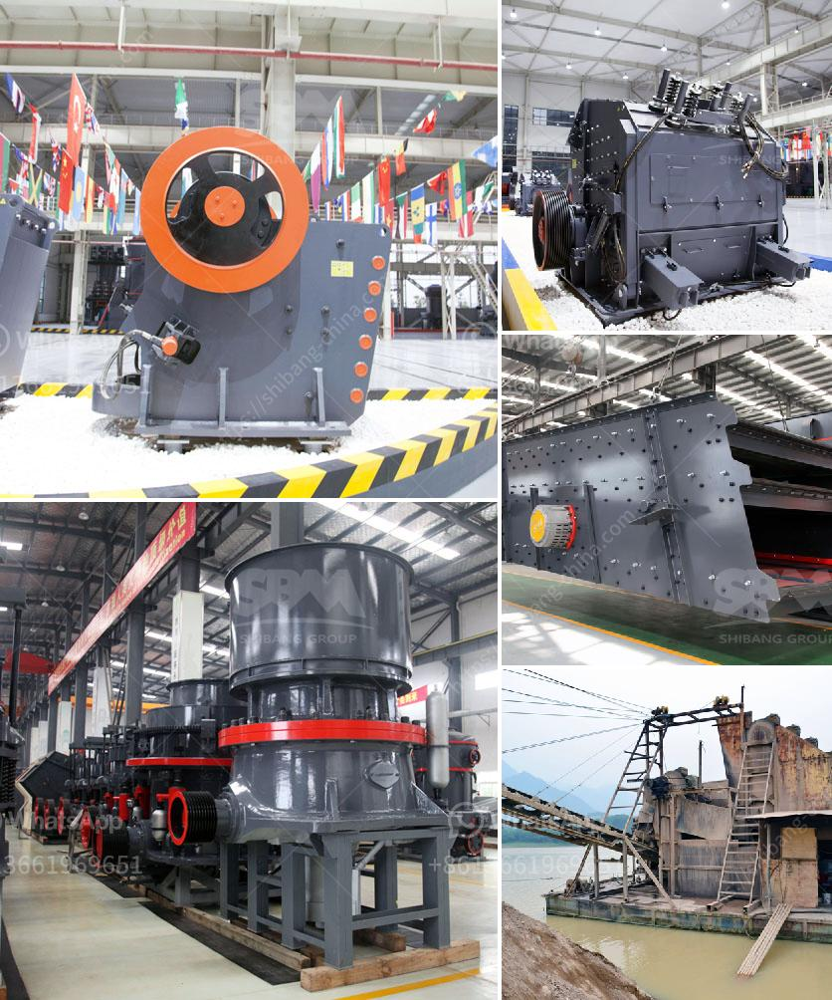

<h3>used portable rock crusher for sale</h3>
When it comes to rock crushing, there’s no one better than a portable rock crusher for sale. It has the features of a larger crusher, yet it’s portable enough to move around the mine site without too much hassle. Used portable rock crushers are famous for their efficiency and flexibility, especially for small-scale contractors. However, finding the right used portable rock crusher can be a daunting task if you’re not well-prepared.

Before you embark on your search for a used portable rock crusher, there are a few things you need to consider. First and foremost, you need to determine the type of rock that will be crushed. Different rocks require different crushers, so knowing the specific type is vital. Additionally, you need to consider the input size of the rocks. This will dictate the size of the crusher you need, ensuring that it can handle the rock size efficiently.

Another factor to consider is the desired output size. Are you looking to produce a specific size of crushed rock? If so, you need to ensure that the used portable rock crusher you’re considering can produce the required output. Check the specifications provided by the manufacturer or seller to determine this.

Additionally, it’s important to assess the power source of the used portable rock crusher. Some crushers are powered by electricity, while others are diesel-powered. Each has its own advantages and disadvantages, so you need to choose the one that aligns with your unique needs. Keep in mind that electric-powered crushers are more convenient if you have access to electricity, as they don't require any fuel. On the other hand, diesel-powered crushers are ideal for remote locations where access to electricity may be limited.

One of the key advantages of opting for a used portable rock crusher is the cost. With new crushers, purchasing one may require a significant initial investment. However, used portable rock crushers can be highly affordable if you consider their value in a long-term perspective. You can avoid the cost of a new crusher by shopping for a used one instead. This will allow you to put your capital to use in other areas of your business while still benefiting from a rock crusher.

Used portable rock crushers are also more environmental-friendly. Deep mining involves excavation of earth’s surface to reach underground minerals. This process results in the disturbance to natural habitats, as well as air and water pollution. However, portable crushers can be conveniently moved from one location to another, reducing the need for extensive earth excavation.

In conclusion, used portable rock crushers offer the advantage of being convenient and efficient. There are a few factors to consider when purchasing one, such as the type of rock, input size, desired output, and power source. Moreover, choosing a used portable rock crusher can save you significant costs and contribute to a more sustainable environment. So, if you’re in the market for a rock crusher, explore the used options available and make an informed decision today.
<h3>Contact us</h3><ul><li><strong>Whatsapp:&nbsp;<a href="https://wa.me/8613661969651">+8613661969651</a></strong></li><li><a href="https://swt.shibang-china.com/?git&amp;zhl&amp;used portable rock crusher for sale"><strong>Online Service(chat now)</strong></a></li></ul><h3>Related</h3><ul><li><a href='200 tph stone crusher price.md'>200 tph stone crusher price</a></li><li><a href='jaw crusher price south africa.md'>jaw crusher price south africa</a></li><li><a href='gold ore crusher for sale.md'>gold ore crusher for sale</a></li><li><a href='cost of dolomite milling machine in india.md'>cost of dolomite milling machine in india</a></li><li><a href='what is the angle of conveyor belts.md'>what is the angle of conveyor belts</a></li></ul>