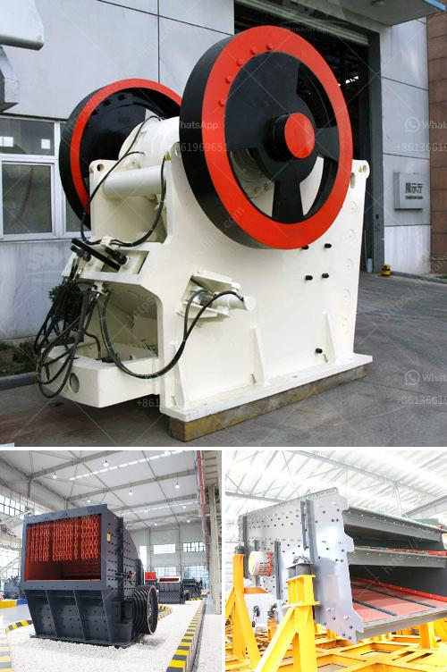

<h3>used raymond roller mills for sale</h3>
Raymond roller mills are widely used in various industries such as mining, construction, chemical industries, and metallurgy. They are efficient and reliable, offering a high grinding efficiency and excellent drying capabilities. These mills are renowned for their low maintenance requirements and high durability.

If you are in the market for a used Raymond roller mill, do not fret! Numerous reputable dealers and suppliers offer these mills at competitive prices. By opting for a used model, you can enjoy the same quality and functionality at a lower cost.

Many sellers provide a variety of Raymond roller mills, ranging in size and capacity to meet your specific industrial needs. These machines consist of a large rotating drum, which grinds and crushes the material into smaller particles. The crushed material is then blown into the separator by a fan, where the fine powder is separated and collected while the coarser particles are returned to the grinding chamber.

Used Raymond roller mills are an excellent investment as they offer the opportunity to acquire high-quality equipment without breaking the bank. Additionally, these mills have a proven track record and are widely used in various applications worldwide.

When purchasing a used Raymond roller mill, it is essential to consider the condition and maintenance history of the machine. Choose a reputable seller who provides detailed information about the mill's maintenance and service history. Proper care and maintenance ensure the longevity and performance of the mill, allowing you to maximize your investment.

In conclusion, used Raymond roller mills are a cost-effective alternative to purchasing new equipment. With their exceptional grinding efficiency and reliability, these mills can enhance your productivity and reduce operational costs. Explore the options available in the market and find a trusted seller to provide you with the perfect Raymond roller mill that suits your requirements.
<h3>Contact us</h3><ul><li><strong>Whatsapp:&nbsp;<a href="https://wa.me/8613661969651">+8613661969651</a></strong></li><li><a href="https://swt.shibang-china.com/?git&amp;zhl&amp;used raymond roller mills for sale"><strong>Online Service(chat now)</strong></a></li></ul><h3>Related</h3><ul><li><a href='basalt crushing equipment.md'>basalt crushing equipment</a></li><li><a href='stone crushers for sale.md'>stone crushers for sale</a></li><li><a href='philippines rock and granite quarries.md'>philippines rock and granite quarries</a></li><li><a href='quartz powder suppliers in dubai.md'>quartz powder suppliers in dubai</a></li><li><a href='limestone processing plant price.md'>limestone processing plant price</a></li></ul>