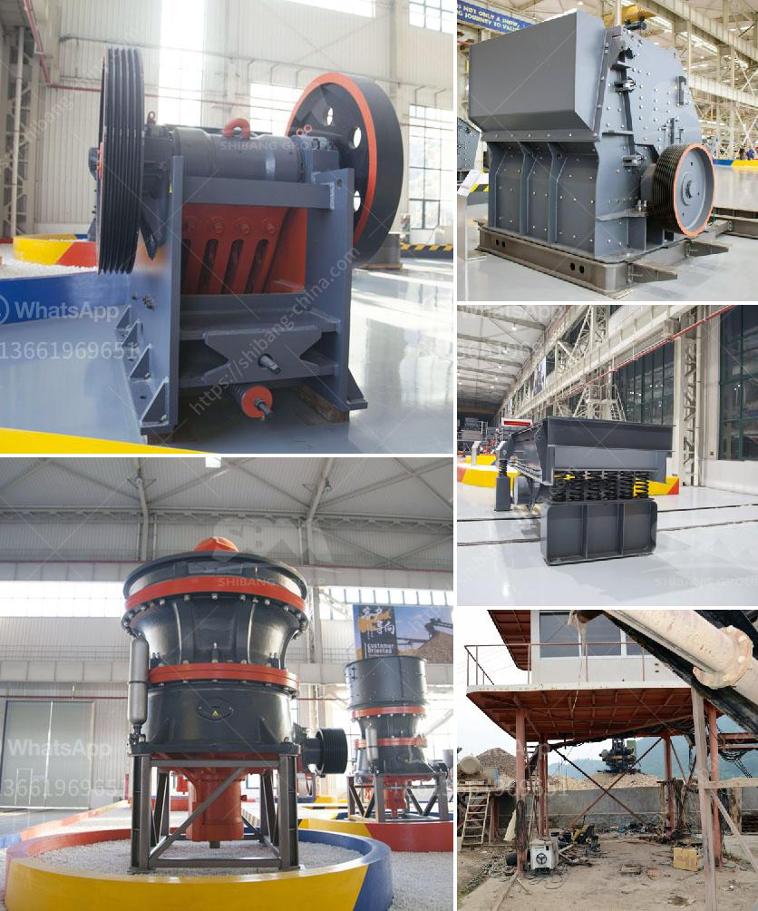

<h3>used stone crusher in nairobi</h3>
Nairobi, located in the central region of Kenya, is the capital and largest city of the country. It is also a major economic hub, attracting numerous businesses and industries due to its strategic location. With a growing population and increased construction activities, there is a high demand for building materials, making the stone crusher industry lucrative in Nairobi.

Stone crushing is the process of reducing large stones into smaller, more manageable sizes. Crushing involves reducing the size of raw materials such as rocks and stones into products that are useful for construction purposes. The stone crusher industry in Nairobi is growing rapidly, and there is a significant increase in the number of used crushers available for sale.

To cater to the rising demand for used crushers, many suppliers in Nairobi have imported new and used stone crushers. In recent years, there has been a significant increase in the importation of used stone crushers, both large and small, from various countries worldwide. These crushers are usually in good condition and provide crushing capabilities that are ideal for various construction projects.

The used stone crushers available in Nairobi range from small scale crushers to large-scale crushers. Depending on your specific needs, you can choose from a variety of used stone crushers suitable for your construction projects. Whether you require a primary crusher, secondary crusher, or even a tertiary crusher, there are used stone crushers available to meet your requirements.

Buying a used stone crusher in Nairobi can provide cost savings and flexibility compared to purchasing new equipment. Used crushers are often more affordable and can be a great investment for those looking to expand their construction operations. Additionally, used crushers are readily available, allowing for quick and easy acquisition without long waiting periods.

In conclusion, the demand for stone crushers in Nairobi continues to grow as construction activities rise in the city. Used stone crushers are a cost-effective option for individuals and businesses looking to acquire crushing equipment without breaking the bank. The availability of various types of used stone crushers in Nairobi provides flexibility and the opportunity to find the perfect crusher for specific construction needs. Whether you are a small-scale contractor or a large construction company, there are used stone crushers in Nairobi that can help you meet your crushing requirements efficiently.
<h3>Contact us</h3><ul><li><strong>Whatsapp:&nbsp;<a href="https://wa.me/8613661969651">+8613661969651</a></strong></li><li><a href="https://swt.shibang-china.com/?git&amp;zhl&amp;used stone crusher in nairobi"><strong>Online Service(chat now)</strong></a></li></ul><h3>Related</h3><ul><li><a href='100 tph stone crusher.md'>100 tph stone crusher</a></li><li><a href='quarry crusher quartz.md'>quarry crusher quartz</a></li><li><a href='sand washing plant in south africa.md'>sand washing plant in south africa</a></li><li><a href='generic mining safety induction powerpoint.md'>generic mining safety induction powerpoint</a></li><li><a href='crusher for quartz.md'>crusher for quartz</a></li></ul>