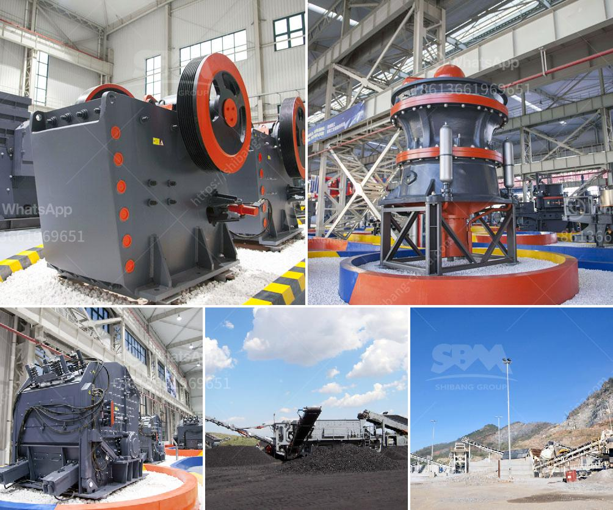

<h3>used stone crusher machine from japan</h3>
Japan is one of the countries that are synonymous with technological innovation, and has been at the forefront of many industries. However, when it comes to the construction and mining industry, the country has a unique approach. As a result, many companies in Japan are turning to used stone crusher machines to meet their construction needs.

Here are some reasons why companies in Japan are looking to buy used stone crusher machines rather than new ones.

1. Cost-effective: It is no secret that buying a brand-new stone crusher machine is quite expensive. By choosing to buy a used machine, companies can save a significant amount of money. Consequently, they can use the money saved on other aspects of their construction projects.

2. Availability: Used stone crusher machines are readily available in the market. In fact, there are many used stone crusher machines available in the market from reliable sellers and manufacturers across Japan. Therefore, when it comes to buying a used stone crusher machine, companies can purchase it directly from the manufacturer or a trusted third-party seller.

3. Maintenance: Another advantage of buying a used stone crusher machine is that companies can rest assured knowing that the machine has been well-maintained. A properly maintained machine will have fewer breakdowns and will be more reliable in the long run. Plus, if any repairs or maintenance are required down the line, there will be a wealth of information available from the previous owner or the manufacturer.

4. Versatility: Used stone crusher machines can be used for various types of construction projects, such as road construction, building demolition, and bridge construction. They can also be used in mining operations for the crushing of coal, minerals, and other materials. Therefore, companies can use these machines for a wide range of applications, making them highly versatile.

5. Environmentally friendly: Buying a used stone crusher machine is also beneficial for the environment. By recycling old machines, companies can reduce the demand for new stone crusher machines, which in turn reduces the need for mining raw materials. This can help reduce the environmental impact of stone crushing operations and promote sustainability.

In conclusion, buying a used stone crusher machine from Japan is a cost-effective and environmentally friendly option for companies in the construction and mining industries. By using a used machine, companies can save money, access readily available machines, and ensure that the machine has been well-maintained. Ultimately, this approach can lead to more profitable and sustainable construction projects.
<h3>Contact us</h3><ul><li><strong>Whatsapp:&nbsp;<a href="https://wa.me/8613661969651">+8613661969651</a></strong></li><li><a href="https://swt.shibang-china.com/?git&amp;zhl&amp;used stone crusher machine from japan"><strong>Online Service(chat now)</strong></a></li></ul><h3>Related</h3><ul><li><a href='dolomite processing plants from germany.md'>dolomite processing plants from germany</a></li><li><a href='mini crusher for gravel sale in philippines.md'>mini crusher for gravel sale in philippines</a></li><li><a href='cost of 500 tonnes per day cement plant ecuador.md'>cost of 500 tonnes per day cement plant ecuador</a></li><li><a href='desain mesin crusher tempurung kelapa.md'>desain mesin crusher tempurung kelapa</a></li><li><a href='mobile crushers for hire in philippines.md'>mobile crushers for hire in philippines</a></li></ul>