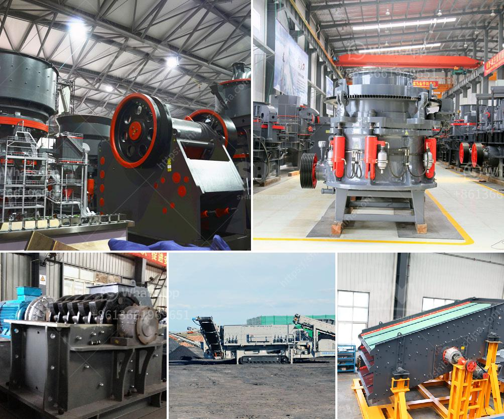

<h3>used stone crusher on sale in jharkhand</h3>
The economy of Jharkhand relies heavily on the mining and agriculture sectors. The state is a leading producer of minerals such as coal, iron ore, and copper. Due to the abundance of mineral resources in Jharkhand, mining activities and stone crusher sale in the state are prevalent.

Jharkhand is blessed with rich reserves of granite, quartzite, and sandstone. The stone crusher market in the state is fragmented in nature due to the prevalence of small, medium, and large-scale stone crushers. The large stone crushing industry in the state is mostly concentrated in the district of Ranchi.

Ranchi being the capital city of Jharkhand also plays a significant role in the sale of used crushers and second-hand crushers on sale in Jharkhand. A majority of the used stone crusher on sale in Jharkhand is located in Ranchi and the surrounding areas.

The Jharkhand government departments concerned with the sale of used stone crushers in Jharkhand and the buyers of these crushers must adhere to the prescribed norms and rules. The government has taken several measures to regulate the stone crushing industry and ensure that it does not pose a threat to the environment.

The sale of used stone crushers in Jharkhand is managed by the Department of Industries and Mines. They issue licenses to the crushers and conduct periodic inspections to ensure compliance with the rules and regulations. The licensing process involves obtaining specific clearances from the pollution control board and other statutory bodies.

The sale of used stone crushers in Jharkhand also requires compliance with various environmental regulations. The crushers must adhere to the norms related to noise pollution, dust pollution, and land use. They must have proper pollution control systems in place to mitigate the adverse impacts on the environment.

The sale of used crushers in Jharkhand is a lucrative business, attracting both buyers and sellers. The buyers are attracted to the relatively low prices of used crushers compared to new ones. Additionally, the buyers can inspect the crushers and assess their condition before making a purchase.

On the other hand, sellers of used stone crushers in Jharkhand can benefit from the robust demand for these machines. The ongoing mining activities in the state create a constant need for crushers, ensuring a steady supply of potential buyers.

However, like any other industry, the sale of used stone crushers in Jharkhand has its challenges. The market is highly competitive, with numerous sellers vying for a share of the market. Maintaining a good reputation, offering competitive prices, and providing excellent after-sales service are crucial for success in this industry.

In conclusion, the sale of used stone crushers in Jharkhand is a thriving business in the state due to the abundance of mineral resources and the demand for crushers in the mining sector. The sellers must adhere to the prescribed norms and regulations to ensure a sustainable and environment-friendly operation. The buyers can take advantage of the relatively low prices of used crushers while inspecting them to ensure their suitability for their specific needs. Overall, the sale of used stone crushers in Jharkhand contributes to the economic growth of the state while meeting the demand for crushing equipment in the mining industry.
<h3>Contact us</h3><ul><li><strong>Whatsapp:&nbsp;<a href="https://wa.me/8613661969651">+8613661969651</a></strong></li><li><a href="https://swt.shibang-china.com/?git&amp;zhl&amp;used stone crusher on sale in jharkhand"><strong>Online Service(chat now)</strong></a></li></ul><h3>Related</h3><ul><li><a href='jaw crusher price south africa.md'>jaw crusher price south africa</a></li><li><a href='price of grinder machine in india.md'>price of grinder machine in india</a></li><li><a href='slag grindimg in ball mill.md'>slag grindimg in ball mill</a></li><li><a href='grinding machinery for sale in guatemala.md'>grinding machinery for sale in guatemala</a></li><li><a href='crusher machine price in sri lanka.md'>crusher machine price in sri lanka</a></li></ul>