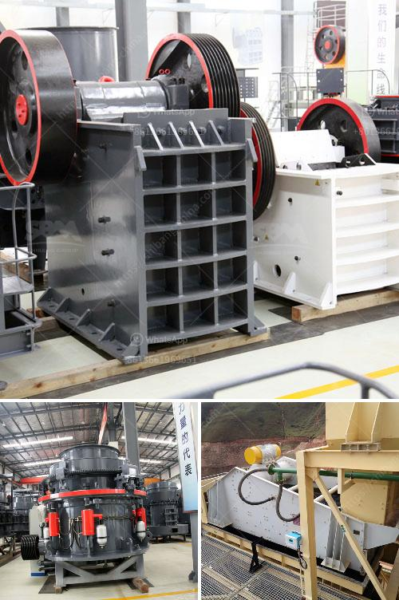

<h3>used stone crushers in pakistan</h3>
In Pakistan, the crushing machines have widely applications in many industries, such as construction, metallurgy, mining, and chemical industries. There are many different types of crushing machines used in these industries, such as jaw crusher, cone crusher, impact crusher, gyratory crusher, and hammer crusher. However, the most commonly used stone crushers in Pakistan are jaw crusher and cone crusher.

Jaw crusher is widely used in various materials processing of mining &construction industries, such as it is suit for crushing granite, marble, basalt, limestone, quartz, cobble, iron ore, copper ore, and some other mineral &rocks. It is commonly used as a primary crusher, which means that it receives materials directly from the loading equipment, usually the excavator or dump truck. Jaw crusher has features such as large crushing ratio, uniform product size, simple structure, reliable operation, easy maintenance, and low operation cost. It is widely used in mining, metallurgy, building materials, highway, railway, water conservancy and chemical industries.

Cone crusher is a kind of advanced crusher with high power, large crushing ratio, and high productivity. It is widely used for secondary and fine crushing in the fields of mining, metallurgy, building materials, and chemical industries. Cone crusher can crush materials with Moh's scale in middle and high hardness such as ironstone, copper ore, limestone, quartz, granite, rock and so on. The standard type (PYB) is applied to secondary crushing; the medium type (PYZ) and the short-head (PYD) are applied to fine crushing.

Pakistan has a large number of minerals including coal, copper, gold, chromite, mineral salt, bauxite and several other minerals. There are also a variety of precious and semi-precious minerals that are also mined. These minerals are found in abundance throughout various parts of Pakistan, and the country has great potential for further exploration and development of its mineral resources.

In order to extract and process these minerals, suitable crushers are required. This is where used stone crushers come in. Used stone crushers are generally required for the extraction and processing of these minerals. The selection of equipment depends on the size of the material processed, the desired output size, and the shape of the final product.

Used stone crushers in Pakistan can effectively improve the production efficiency and crushing capacity. For the used stone crushers, there are some maintenance and precautions to be taken. For example, it is necessary to check the wear of the parts, such as the jaws, the lining plates and the impacting plates regularly. If they are worn, they should be replaced in time to ensure the normal operation of the equipment. In addition, attention should be paid to the lubrication system to ensure the smooth operation of the equipment. 

In conclusion, the used stone crushers in Pakistan have proven to be effective in providing crushed stones for the construction industry. They are cost-effective and reliable machines that can decrease the production costs and increase production capacity. Therefore, they are widely used in Pakistan and have a promising market.
<h3>Contact us</h3><ul><li><strong>Whatsapp:&nbsp;<a href="https://wa.me/8613661969651">+8613661969651</a></strong></li><li><a href="https://swt.shibang-china.com/?git&amp;zhl&amp;used stone crushers in pakistan"><strong>Online Service(chat now)</strong></a></li></ul><h3>Related</h3><ul><li><a href='bauxite mining machine.md'>bauxite mining machine</a></li><li><a href='mobile crusher price and option.md'>mobile crusher price and option</a></li><li><a href='aggregate wash plant for sale.md'>aggregate wash plant for sale</a></li><li><a href='different ore beneficiation equipment all over the world.md'>different ore beneficiation equipment all over the world</a></li><li><a href='quarry business in nigeria.md'>quarry business in nigeria</a></li></ul>