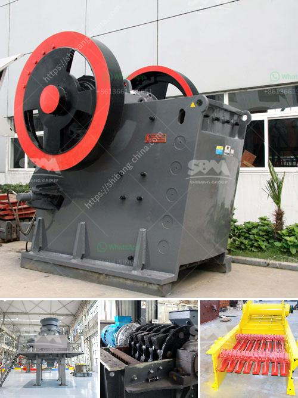

<h3>used stone crushers in south africa in zambia</h3>
Stone crushers are widely used in various sectors of the mining industry in South Africa. They can be used for crushing different materials, such as stones, rocks, marbles, granite, iron ore, and copper ore. Some of the different types of stone crushers include jaw crushers, cone crushers, impact crushers, mobile crushers, and so on.

South Africa is rich in abundant mineral resources, especially in the fields of gold, diamond, chrome, iron ore, and coal. Due to its high economic value, the demand for stone crushers is increasing rapidly in the country. Stone crushers can help to process these raw materials into smaller pieces or even powder size, which can be used for various purposes.

However, not everyone can afford to buy new stone crushers, especially for those small-scale mining investors or quarry operators. In such cases, used stone crushers become a perfect solution. They are cost-effective and can help to reduce the production cost significantly. Used stone crushers can be found in various types, such as jaw crushers, impact crushers, and cone crushers. These machines can handle different materials, such as limestone, shale, basalt, granite, concrete, and so on.

In Zambia, there are many used stone crushers in South Africa with low price and high performance. As a professional mining machinery manufacturer and exporter, Zenith provides various types of used stone crushers for sale in South Africa. These used stone crushers have been exported to Zambia for over 20 years and are welcomed by local clients. The used stone crushers include jaw crusher, cone crusher, impact crusher and mobile crusher. If you are interested in these stone crushers, please contact us. We will offer you customized solutions according to your requirements.

In conclusion, used stone crushers are very popular in South Africa, especially in Zambia. As a leading mining machinery manufacturer and exporter in China, Zenith can provide various types of used stone crushers for sale, such as jaw crusher, impact crusher, cone crusher, and mobile crusher. If you are interested in our products, please contact us for more information.
<h3>Contact us</h3><ul><li><strong>Whatsapp:&nbsp;<a href="https://wa.me/8613661969651">+8613661969651</a></strong></li><li><a href="https://swt.shibang-china.com/?git&amp;zhl&amp;used stone crushers in south africa in zambia"><strong>Online Service(chat now)</strong></a></li></ul><h3>Related</h3><ul><li><a href='quarry mining business plan pdf.md'>quarry mining business plan pdf</a></li><li><a href='process of making methanol from coal.md'>process of making methanol from coal</a></li><li><a href='ball mill suppliers uk.md'>ball mill suppliers uk</a></li><li><a href='conveyor belt user in tanzania.md'>conveyor belt user in tanzania</a></li><li><a href='stone jaw crusher machinery supplier.md'>stone jaw crusher machinery supplier</a></li></ul>