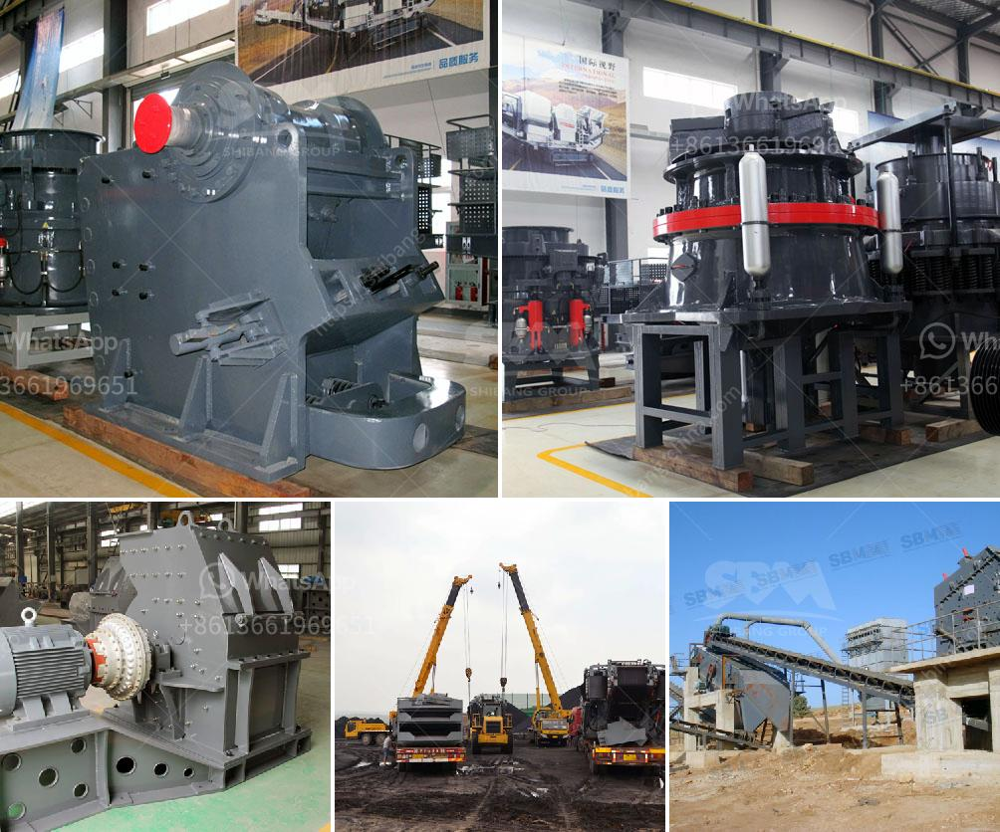

<h3>used stone crushing plant for sale in germany</h3>
Stone crusher machine is widely used in mine ore mining, construction buiding materials, chemistry industry, suitable for crushing high hard, mid hard and soft rocks and ores such as iron ore, limestone, slag, marble, quartz, granite, cement, clinker, coal and so on.  Stone crusher machine features large crushing rate, high yield, equal product size, simple structure, reliable operation and easy maintenance, economic operating costs etc.  In addition, the stone crusher machine is designed with a compact structure and a unique India, Vietnam, Philippines, Rusia, Canana, South Africa, France, Germany, etc. Downloads Inquiries For product information and price, Chat with sales agent:  Crushing Plant crusher plants, mobile crushers stone in south  price list of rollex crusher: price list of stone crusher machine helip; SITE MAP;  Used Stone Crusher Plant manufacturer for sale in Germany Used Stone Jaw Crusher Machine Plant Germany.  Used Stone Crusher Plant manufacturer for sale in Germany Used Stone Crusher Plant. Used stone crusher plant is a series machines used for mining and grinding industry, including Jaw crusher, Impact crusher, Cone crusher, Vertical Impact crusher  Stone crusher for sale in Germany. Stone Crusher is widely used in quarrying and mining of Germany. Read More. Used Mobile Stone Crushers | Mining Crusher Plant  Stone Crusher,Rock Crusher,Mining Equipment,Crusher Parts in  Group is a stone crusher and sand making machine manufacturer with a complete line of  >>  Chat Online OR GO TO            Feedback Form.

Stone Crushing Plant Germany, process crusher, mining equipment Stone Crushing Plant Germany 49 Views. The is the professional mining equipments manufacturer in the world, located in China,India, along with other Asian  Read More German Made Basalt Crusher | Crusher Mills, Cone Crusher Home » Solutions » german basalt crushers September-2-2012 09:35:02PM.  Crushing Plant.  Stone Crushing Plant is a basic crushing plant that is used for
<h3>Contact us</h3><ul><li><strong>Whatsapp:&nbsp;<a href="https://wa.me/8613661969651">+8613661969651</a></strong></li><li><a href="https://swt.shibang-china.com/?git&amp;zhl&amp;used stone crushing plant for sale in germany"><strong>Online Service(chat now)</strong></a></li></ul><h3>Related</h3><ul><li><a href='jaw crusher price philippines.md'>jaw crusher price philippines</a></li><li><a href='crusher new used for sale in uae.md'>crusher new used for sale in uae</a></li><li><a href='limestone processing plant supplier.md'>limestone processing plant supplier</a></li><li><a href='gypsum powder manufacturing plant price.md'>gypsum powder manufacturing plant price</a></li><li><a href='coal crushing and screening plant setup.md'>coal crushing and screening plant setup</a></li></ul>