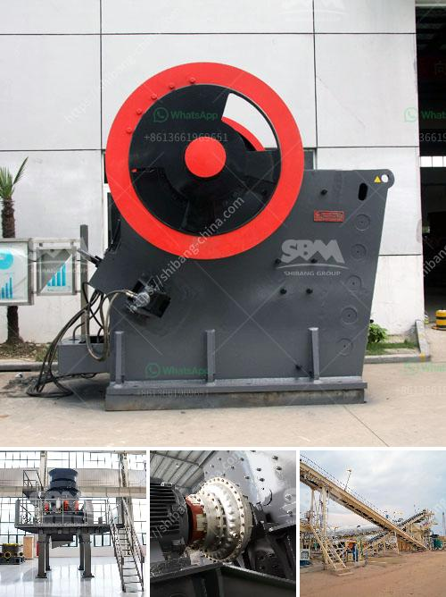

<h3>used vertical roller mill for sale</h3>
Vertical roller mill has long been a popular choice for grinding raw materials into raw meal. With the global increase in demand for cement and minerals, the market for vertical roller mills has grown rapidly. Increasingly, cement producers are considering using a vertical roller mill for cement grinding.

Therefore, the market for used vertical roller mills is provided with a great variety of choices. These machines are in great demand and are sold with a high turnover rate. The availability of used vertical roller mills is also due to their energy-saving capabilities, making them an attractive option for cement producers looking to enhance their sustainability.

Used vertical roller mills offer several advantages. Firstly, they are generally more cost-effective than purchasing new equipment. Secondly, when buying used equipment, there is a good chance that it has been well-maintained and is in good working condition. This reduces the risk of unexpected breakdowns or costly repairs. Additionally, used vertical roller mills can often be acquired and installed much more quickly than new mills. This is an ideal solution for companies that have time-sensitive projects.

When purchasing a used vertical roller mill, it is important to consider several factors. These include the mill's capacity, power consumption, and overall condition. It is also crucial to determine if the mill comes with all the necessary accessories and spare parts. Conducting a thorough inspection of the equipment and requesting detailed maintenance and service records can help ensure a wise investment.

In conclusion, buying a used vertical roller mill for sale can be a practical and reliable solution for cement producers. With their cost-effectiveness, energy-saving capabilities, and quick installation, these mills provide an excellent opportunity to enhance grinding operations. However, careful consideration of various factors is essential to make a well-informed decision and ensure a successful purchase.
<h3>Contact us</h3><ul><li><strong>Whatsapp:&nbsp;<a href="https://wa.me/8613661969651">+8613661969651</a></strong></li><li><a href="https://swt.shibang-china.com/?git&amp;zhl&amp;used vertical roller mill for sale"><strong>Online Service(chat now)</strong></a></li></ul><h3>Related</h3><ul><li><a href='cost of setting up a production plant for tantalum.md'>cost of setting up a production plant for tantalum</a></li><li><a href='balls mill in uk.md'>balls mill in uk</a></li><li><a href='silica processing company.md'>silica processing company</a></li><li><a href='copper processing plant.md'>copper processing plant</a></li><li><a href='bauxite calcination plant cost in india.md'>bauxite calcination plant cost in india</a></li></ul>