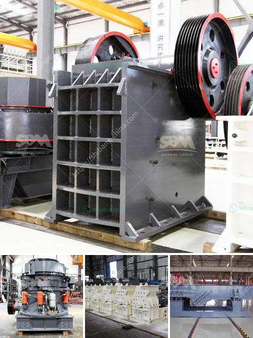

<h3>utiliza equipos de molienda fina molino</h3>
En la industria de la molienda, la utilización de equipos de molienda fina molino se ha convertido en una práctica común para mejorar la eficiencia de producción. Estos equipos son especialmente diseñados para reducir el tamaño de las partículas y lograr un producto final de alta calidad. En este artículo, exploraremos los beneficios de utilizar estos equipos y cómo pueden ayudar a aumentar la eficiencia de producción.

Una de las principales ventajas de utilizar equipos de molienda fina molino es que permiten obtener partículas más pequeñas y uniformes. Esto es especialmente importante en industrias como la farmacéutica, la alimentaria y la química, donde se requiere un control preciso del tamaño de las partículas para garantizar la calidad del producto final. Con estos equipos, se puede lograr una molienda precisa y consistente en cada lote de producción, lo que resulta en un producto final de alta calidad y capacidad de respuesta a las demandas del mercado.

Además, los equipos de molienda fina molino también ayudan a maximizar el rendimiento y la eficiencia de los procesos de producción. Al reducir el tamaño de las partículas, se aumenta la superficie de contacto entre las partículas y los medios de molienda, lo que a su vez aumenta la eficiencia de la molienda y reduce el tiempo de procesamiento. Como resultado, se puede lograr una producción más rápida y eficiente, lo que se traduce en una mayor capacidad de producción y una reducción de los costos de producción.

Otra ventaja importante de utilizar equipos de molienda fina molino es su versatilidad. Estos equipos se pueden utilizar para moler una amplia gama de materiales, desde minerales y productos químicos hasta alimentos y productos farmacéuticos. Esto los convierte en una opción flexible para diversas industrias, ya que se pueden adaptar a diferentes requerimientos de molienda y tipos de materiales.

Además, los equipos de molienda fina molino también ofrecen un control preciso del proceso de molienda. Estos equipos están equipados con diversas configuraciones y ajustes que permiten controlar parámetros como la velocidad de rotación, la presión de molienda y el tiempo de procesamiento. Esto permite a los operadores ajustar y optimizar el proceso de molienda según las necesidades específicas de producción, lo que a su vez mejora la calidad y la eficiencia del producto final.

En resumen, utilizar equipos de molienda fina molino puede ser muy beneficioso para mejorar la eficiencia de producción en diversas industrias. Estos equipos permiten obtener partículas más pequeñas y uniformes, maximizar el rendimiento y la eficiencia del proceso de molienda, ofrecer versatilidad en la molienda de diferentes materiales y proporcionar un control preciso del proceso de molienda. Con todas estas ventajas, no es de extrañar que cada vez más empresas estén optando por utilizar equipos de molienda fina molino para mejorar su producción.
<h3>Contact us</h3><ul><li><strong>Whatsapp:&nbsp;<a href="https://wa.me/8613661969651">+8613661969651</a></strong></li><li><a href="https://swt.shibang-china.com/?git&amp;zhl&amp;utiliza equipos de molienda fina molino"><strong>Online Service(chat now)</strong></a></li></ul><h3>Related</h3><ul><li><a href='coal crusher and screen plant for sale.md'>coal crusher and screen plant for sale</a></li><li><a href='cement grinding mill suppliers.md'>cement grinding mill suppliers</a></li><li><a href='south africa coal mining cost per ton.md'>south africa coal mining cost per ton</a></li><li><a href='impact crusher hammer mill.md'>impact crusher hammer mill</a></li><li><a href='mobile hammer crusher.md'>mobile hammer crusher</a></li></ul>