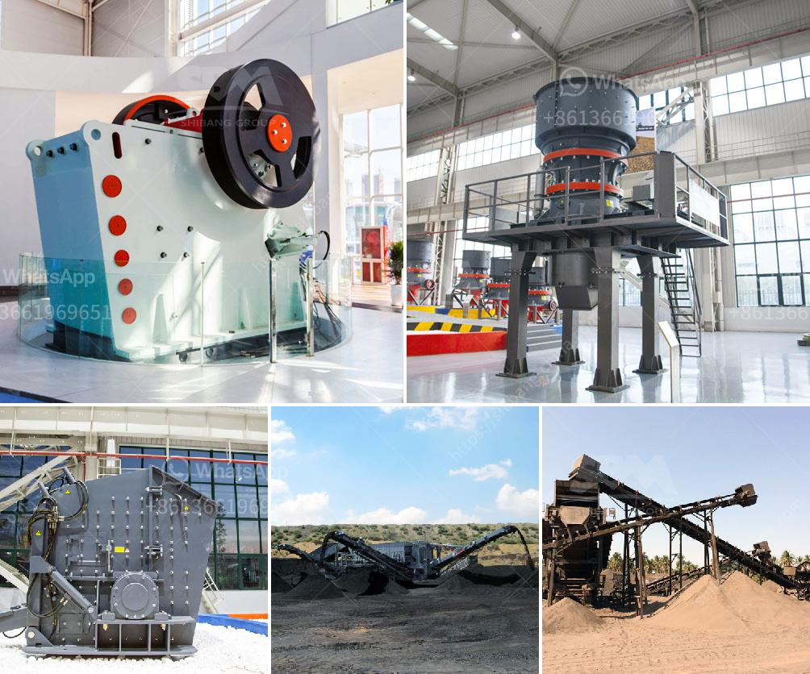

<h3>vacancies to work crushing plants in malaysia</h3>
Are you someone who has a passion for the environment and sustainable development? Do you have experience working with heavy machinery and have a knack for problem-solving? If so, you might be interested in exploring career opportunities in crushing plants in Malaysia.

Malaysia, known for its rich natural resources, is increasingly focusing on sustainable development to preserve its biodiversity and mitigate the impacts of climate change. One crucial aspect of this effort is the management of waste and the recycling of materials. Crushing plants play a vital role in this process by breaking down large rocks, concrete, and other materials into smaller sizes that can be reused for various purposes.

Working in a crushing plant can be both rewarding and challenging. From operating heavy machinery to maintaining and troubleshooting equipment, it requires a diverse skill set. If you enjoy being hands-on and have a knack for problem-solving, this might be the perfect career path for you. Additionally, working in a crushing plant allows you to contribute to Malaysia's sustainability goals and make a positive impact on the environment.

As the demand for recycled materials continues to grow, so does the need for skilled professionals to operate and manage crushing plants. To meet this demand, numerous vacancies are available in the Malaysian job market. These include positions such as equipment operators, mechanics, maintenance technicians, and plant supervisors.

Equipment operators are responsible for operating and controlling the machinery in the crushing plant. They must have a deep understanding of the equipment and be able to monitor its performance efficiently. Mechanics and maintenance technicians, on the other hand, play a pivotal role in ensuring the smooth functioning of the crushing plant. They conduct regular inspections, perform repairs, and oversee maintenance tasks to minimize downtime and ensure optimum performance.

Beyond technical skills, employers also look for individuals with strong communication and teamwork abilities. Working in a crushing plant entails collaborating with colleagues to achieve production targets, as well as communicating effectively with superiors and other departments. Adaptability and a strong commitment to safety are also crucial characteristics that employers seek in potential candidates.

Vacancies in crushing plants are not limited to large companies. Small to medium-sized enterprises in Malaysia are also investing in this sector. These companies offer opportunities for career growth and play a vital role in driving innovation in the recycling industry.

If you're considering a career in crushing plants, there are several ways to start exploring opportunities. Online job portals, company websites, and professional networking platforms can provide you with access to a wide range of vacancies. Additionally, attending job fairs and industry-specific events allows you to network with industry professionals and gain insights into the latest trends and developments.

To conclude, vacancies in crushing plants in Malaysia offer promising career prospects for individuals passionate about the environment and sustainable development. By working in this field, you can play an active role in Malaysia's efforts to reduce waste and preserve its natural resources. Whether you have experience in heavy machinery or are looking to acquire new skills, this industry welcomes professionals with diverse backgrounds and offers them opportunities for growth and success.
<h3>Contact us</h3><ul><li><strong>Whatsapp:&nbsp;<a href="https://wa.me/8613661969651">+8613661969651</a></strong></li><li><a href="https://swt.shibang-china.com/?git&amp;zhl&amp;vacancies to work crushing plants in malaysia"><strong>Online Service(chat now)</strong></a></li></ul><h3>Related</h3><ul><li><a href='puzzolana stone crusher for sale.md'>puzzolana stone crusher for sale</a></li><li><a href='starting a quarry business in nigeria.md'>starting a quarry business in nigeria</a></li><li><a href='stone crusher plant ton per hour.md'>stone crusher plant ton per hour</a></li><li><a href='list of equipments for a quarry crusher.md'>list of equipments for a quarry crusher</a></li><li><a href='mobile clusher for hire tanzania.md'>mobile clusher for hire tanzania</a></li></ul>