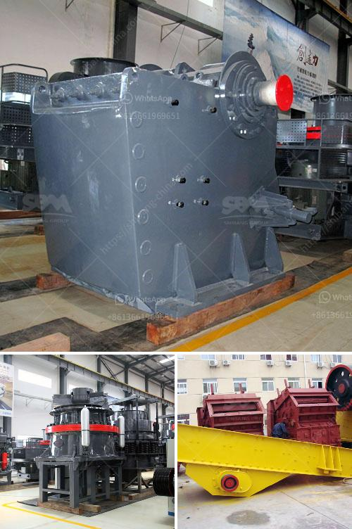

<h3>vertical grinding machine defination</h3>
A vertical grinding machine is a type of surface grinding machine that is used to give a smooth finish to the surfaces of a variety of materials. The vertical grinding machine has a vertical spindle that corresponds to the vertical direction of the grinding wheel. The spindle is typically equipped with a grinding wheel that rotates counter-clockwise.

This type of grinding machine is commonly used for applications requiring high precision and accuracy, such as flat and parallel surface grinding. It is widely used in industries such as aerospace, automotive, and defense, where precision machining is crucial.

The vertical grinding machine operates by removing material from the workpiece using a rotating grinding wheel. The wheel is coated with an abrasive material, such as diamond or aluminum oxide, that cuts away small chips of material as it rotates. The speed of rotation and the depth of cut can be controlled to achieve the desired surface finish.

One of the advantages of using a vertical grinding machine is its ability to perform both grinding and milling operations. This versatility allows for more efficient and cost-effective manufacturing processes. Additionally, the vertical orientation of the machine allows for greater stability, resulting in higher accuracy and precision.

The vertical grinding machine can be used to grind a variety of materials, including metals, ceramics, plastics, and composites. It is especially useful for grinding large and heavy workpieces, as it has a larger working area compared to horizontal grinding machines.

In conclusion, a vertical grinding machine is a versatile tool that is used for precision surface grinding. It offers superior accuracy and stability, making it suitable for a wide range of applications. Whether it is used in the aerospace industry or for general manufacturing, the vertical grinding machine ensures a smooth and precise finish on various workpieces.
<h3>Contact us</h3><ul><li><strong>Whatsapp:&nbsp;<a href="https://wa.me/8613661969651">+8613661969651</a></strong></li><li><a href="https://swt.shibang-china.com/?git&amp;zhl&amp;vertical grinding machine defination"><strong>Online Service(chat now)</strong></a></li></ul><h3>Related</h3><ul><li><a href='quarry business for sale in nigeria.md'>quarry business for sale in nigeria</a></li><li><a href='fly ash processing plant machinery.md'>fly ash processing plant machinery</a></li><li><a href='output of crushing plant.md'>output of crushing plant</a></li><li><a href='brick crushers south africa.md'>brick crushers south africa</a></li><li><a href='hammer mill prices south africa.md'>hammer mill prices south africa</a></li></ul>