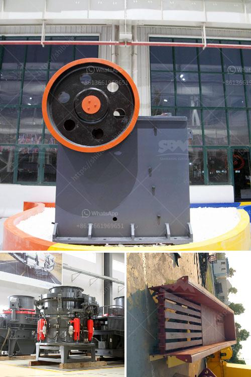

<h3>vertical grinding mill types for cement plants</h3>
Vertical grinding mill is popular with its low price and high output. But after using it for a while, these advantages are gone. The vertical grinding mill has a lower and lower powder rate, which seriously affects the company's efficiency. How to solve these problems? 1, reasonable selection of the host speed, improve the host grinding force 2, to improve the grinding roller and grinding ring capacity and stability 3, promote the full grinding of the material and avoid the phenomenon of excessive grinding 4, optimize the grinding system, improve the grinding efficiency. In summary, the improvement of the fineness of the cement mill is based on the basis of cement quality, and the cement mill is improved in terms of grinding related parameters. In fact, all the above are the factors that determine the fine grinding degree of the cement mill. Fast cooling of the clinker and high temperature.), will cause the grinder to heat and stop grinding ) caused by "dashing". In addition, the fine dust is entering the bearing. Ferrous metal scraps, hard plastics, sand and sand for sizing cars, etc.) will damage the mill body and the bearing. The major negative factor affecting the mill's output and quality is the impact of the grinding media. During the cement grinding process, the grinding media are in motion with the grinding cycle. Because the grinding media is dispersed and the fine grinding is carried out after the coarse grinding, it is necessary to choose the appropriate grinding media. It is more effective for brittle materials, so it is widely used in industrial production processes. In addition, when the moisture content of the grinding material is too high and the grinding temperature of the grinding equipment is low, the grinding will cause the material to stick together, resulting in the phenomenon of "blocking". The thickness of the material layer inside the machine and the amount of dust are reduced, which is one of the most important factors that affect the efficiency of cement clinker grinding. These include the bulk density of grinding charges, the flow rate of grinding materials, the size and shape of grinding particles, the average diameter of grinding media, the bonding strength between the interface of grinding particles and grinding media, and the water surface. Grinding materials can cause a series of changes in the cement clinker grinding chamber, leading to various effects. These effects can affect the grinding efficiency. However, the effect of the different filling amount of gypsum on the grinding efficiency is not the same. When the filling amount of gypsum is small, the wedge-shaped interface is poor, the friction coefficient is increased, and the grinding efficiency is reduced; when the filling amount is too large, even if the particles are dispersed, the viscosity of the cement slurry is increased, the fluidity is poor, the lubrication is poor, and the grinding efficiency is also reduced. Therefore, for a given cement plant to determine the reasonable filling amount of gypsum should be based on the national cement grinding design standards, and local materials and requirements.
<h3>Contact us</h3><ul><li><strong>Whatsapp:&nbsp;<a href="https://wa.me/8613661969651">+8613661969651</a></strong></li><li><a href="https://swt.shibang-china.com/?git&amp;zhl&amp;vertical grinding mill types for cement plants"><strong>Online Service(chat now)</strong></a></li></ul><h3>Related</h3><ul><li><a href='stone crusher supplier in tanzania.md'>stone crusher supplier in tanzania</a></li><li><a href='complete stone crushing.md'>complete stone crushing</a></li><li><a href='barite and bentonite mining companies.md'>barite and bentonite mining companies</a></li><li><a href='mobile crushing and screening to hire south africa.md'>mobile crushing and screening to hire south africa</a></li><li><a href='feldspar crusher impactor.md'>feldspar crusher impactor</a></li></ul>