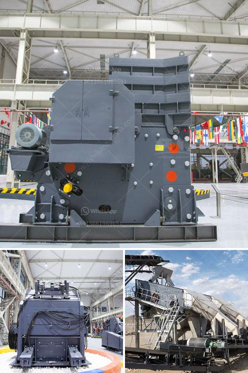

<h3>vertical impact crusher quote</h3>
A vertical impact crusher quote refers to the price at which a manufacturer or supplier is willing to sell a vertical impact crusher. This type of crushing equipment is often used in the mining and construction industries to break down large rocks and stones into smaller pieces.

One of the key advantages of a vertical impact crusher is its ability to produce a consistent, high-quality end product. Unlike other types of crushers, such as jaw or cone crushers, which rely on pressure or compression to break down materials, a vertical impact crusher uses the principle of rock-on-rock crushing. This means that the material is fed into the crusher and thrown against a fixed surface or anvils, causing it to break into smaller pieces.

When considering a vertical impact crusher quote, there are several factors that may influence the price. These include the size and capacity of the crusher, the type and quality of the materials used in its construction, and the reputation and experience of the manufacturer or supplier.

It's important to note that while price is an important factor, it shouldn't be the sole determining factor when choosing a vertical impact crusher. Other considerations, such as the reliability and performance of the equipment, the after-sales support provided by the manufacturer or supplier, and the specific needs and requirements of the project, should also be taken into account.

In conclusion, when considering a vertical impact crusher quote, it's important to look beyond the price and consider the overall value and suitability of the equipment for the specific application. Investing in a high-quality vertical impact crusher can lead to increased productivity, efficiency, and profitability in the long run.
<h3>Contact us</h3><ul><li><strong>Whatsapp:&nbsp;<a href="https://wa.me/8613661969651">+8613661969651</a></strong></li><li><a href="https://swt.shibang-china.com/?git&amp;zhl&amp;vertical impact crusher quote"><strong>Online Service(chat now)</strong></a></li></ul><h3>Related</h3><ul><li><a href='kobe crushers singapore suppliers.md'>kobe crushers singapore suppliers</a></li><li><a href='orifice of coal mill machine.md'>orifice of coal mill machine</a></li><li><a href='2 micron limestone grinding unit in india.md'>2 micron limestone grinding unit in india</a></li><li><a href='crushing plant application.md'>crushing plant application</a></li><li><a href='sand washing machine in ethiopia.md'>sand washing machine in ethiopia</a></li></ul>